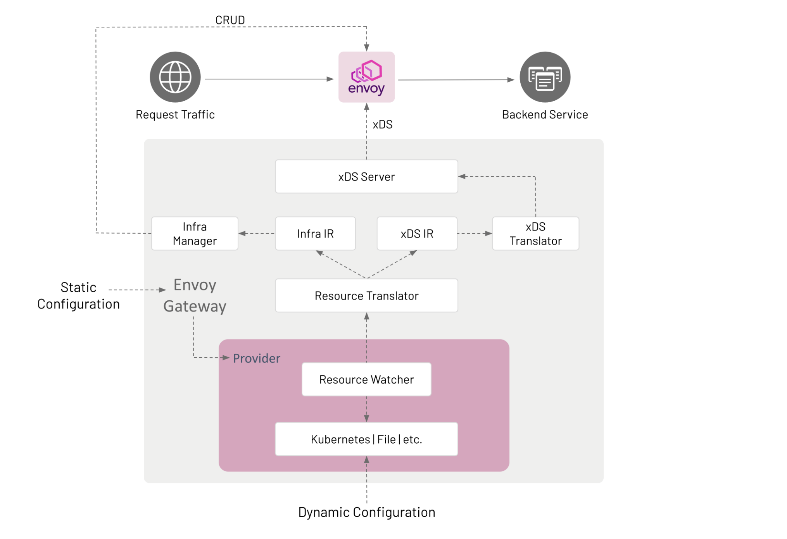

## Envoy Gateway

Envoy Gateway是一个开源项目，用于将[Envoy Proxy](https://www.envoyproxy.io/)作为独立或基于 Kubernetes 的应用程序网关进行管理。[Gateway API](https://gateway-api.sigs.k8s.io/)资源用于动态供应和配置托管Envoy代理.

Envoy Gateway项目的高级目标是通过支持多种入口和**L7/L4**流量路由用例的富有表现力、可扩展、面向角色的API来降低使用难度.

为了便于我们阅读及理解后续概念, 我们首先明确以下两个概念:

+ **EnvoyProxy**: Gateway实例, 在EnvoyGateway中也被称为数据平面(data-plane), 它是实际上处理南北流量的实例
+ **EnvoyGateway**: Gateway控制器, 在EnvoyGateway中也被成为控制平面(control-plane), 它实际上是一个k8s控制器, 它会处理gateway-api请求, 以及动态分发EnvoyProxy的配置.

### Goal

**目标**

EnvoyGateway的目标：

+ 具有表现力的API(使用KubernetesGatewayAPI即可操作)
+ 所有环境下均可使用(Kubernetes和非Kubernetes环境)
+ 可拓展性(可以使用xDS API进行二次开发)


在基于Envoy进行拓展时, 我们常会听见两个术语:

- 控制平面: 用于提供应用程序网关和路由功能的相互关联的软件组件的集合。控制平面由 Envoy Gateway实现，并提供管理数据平面的服务。这些服务在[组件](https://gateway.envoyproxy.io/v0.6.0/design/system-design/#components)部分中有详细介绍。
- 数据平面: 提供智能应用程序级流量路由，并作为一个或多个Envoy代理实现。

> 如果有使用过istio, 对这两个名词应该很熟悉


**架构**



从架构图中我们可以看到两个比较重要的部分: **静态配置**和**动态配置**

**静态配置**

静态配置用于在启动Envoy Gateway时的配置. 例如: 更改GatewayClass控制器名称、配置Provider等。目前，Envoy Gateway仅支持通过配置文件进行配置。如果未提供配置文件,Envoy Gateway将使用默认配置参数启动。

**动态配置**

动态配置基于声明**数据平面**的期望状态并使用**协调循环将实际状态驱动到期望状态**的概念. 数据平面的期望状态被定义为提供以下服务的Kubernetes资源：

- [基础设施管理: 管理数据平面基础设施，即部署、升级等。此配置通过GatewayClass](https://gateway-api.sigs.k8s.io/concepts/api-overview/#gatewayclass)和[Gateway](https://gateway-api.sigs.k8s.io/concepts/api-overview/#gateway)资源表示。可以引用`EnvoyProxy`[自定义资源](https://kubernetes.io/docs/concepts/extend-kubernetes/api-extension/custom-resources/)对gatewayclass.spec.parametersRef修改数据平面基础设施默认参数，例如使用`ClusterIP`服务而不是`LoadBalancer`服务来公开Envoy网络端点。
- 流量路由: 定义如何处理对后端服务的应用程序级请求。例如，将对`www.baidu.com`的所有 HTTP 请求路由到运行 Web 服务器的后端服务。此配置通过[HTTPRoute](https://gateway-api.sigs.k8s.io/concepts/api-overview/#httproute)和[TLSRoute](https://gateway-api.sigs.k8s.io/concepts/api-overview/#tlsroute)资源来表达，这些资源匹配、过滤流量并将流量路由到[后端](https://gateway-api.sigs.k8s.io/reference/spec/#gateway.networking.k8s.io/v1.BackendObjectReference)。尽管后端可以是任何有效的 Kubernetes Group/Kind资源，但Envoy Gateway仅支持[Service](https://kubernetes.io/docs/concepts/services-networking/service/)引用.


### Components

#### **Provider**

Provider是一个基础设施组件，Envoy Gateway调用它来建立其运行时配置、解析服务、持久数据等. Provider在Envoy Gateway启动时通过静态配置进行配置.

**Kubernetes Provider**

- 使用 Kubernetes 风格的控制器来协调构成[动态配置的](https://gateway.envoyproxy.io/v0.6.0/design/system-design/#dynamic-configuration)Kubernetes 资源。
- 通过 Kubernetes API CRUD 操作管理数据平面。
- 使用 Kubernetes 进行服务发现。
- 使用 etcd（通过 Kubernetes API）来保存数据。

**File Provider**

- 使用文件观察器来观察定义数据平面配置的目录中的文件。
- 通过调用内部 API 来管理数据平面，例如`CreateDataPlane()`.
- 使用主机的 DNS 进行服务发现。
- 如果需要，本地文件系统用于保存数据。


#### **Resource Watcher(资源监听器)**

Resource Watcher监视用于建立和维护Envoy Gateway动态配置的资源. Watch资源的机制是特定于Provider的，例如通知程序、缓存等用于Kubernetes Provider。

**NOTE:** Resource Watcher使用配置的*Provider*作为输入，并将资源提供给资源转换器作为输出。


#### **Resource Translator(资源转换器)**

Resource Translator转换外部资源, e.g. GatewayClass, 从Resource Watcher转换为Intermediate Representation (IR)中间表示

- 从Resource Watcher中转换基础设施特定的resources/fields到Infra IR.
- 从Resource Watcher中转换Proxy代理的resources/fields到xDS IR.

**Note:** 资源转换器是作为package`Translator`中的API类型实现的`gatewayapi`.

实际上就是将各类不同的资源进行相互转换. 例: 将gateway-api资源转换为xDS-api资源, 将gateway-api转为infra-api资源等.


#### **Intermediate Representation (IR中间表示)**

Intermediate Representation定义了将外部资源转换为的内部数据模型。这使得Envoy Gateway能够与用于动态配置的外部资源解耦。IR包括用作Infra Manager输入的Infra IR和用作 xDS Translator输入的xDS IR.

**Infra IR**: 用作托管数据平面基础设施的内部定义。 

**xDS IR**: 用作托管数据平面xDS配置的内部定义。


**xDS Server**

xDS Server是基于[Go Control Plane](https://github.com/envoyproxy/go-control-plane)的 xDS gRPC-Server. Go控制平面实现了Delta xDS服务器协议，并负责使用xDS来配置数据平面


#### **Infra Manager** 

基础设施管理器（Infra Manager）是一个特定于Provider的组件.负责管理以下基础设施：

**数据平面**: 管理运行托管Envoy代理所需的所有基础设施。例如，**在Kubernetes集群中运行Envoy需要CRUD实例部署、服务等资源。** 

**辅助控制平面**: 用于实施需要与托管Envoy代理进行外部集成的应用程序Gateway功能的可选基础设施。例如, 全局速率限制需要预配和配置Envoy速率限制服务和速率限制过滤器。此类功能通过 Custom Route Filters扩展向用户公开。 基础设施管理器使用*基础设施中间表示（Infra IR）*作为输入，以管理数据平面基础设施。


### Watching Components

Envoy Gateway由多个在进程中通信的组件构成。其中一些组件（即提供者）监视外部资源，并将它们所看到的内容"发布(Sub)"供其他组件消费；另一些组件观察其他组件发布的内容并对其进行操作（例如，资源转换器观察提供者发布的内容，然后发布其自己的结果，由另一组件观察）。一些内部发布的结果会被多个组件消费。

为了促进这种通信，使用了 watchable 库。watchable.Map 类型非常类似于标准库的 sync.Map 类型，但支持 .Subscribe（和 .SubscribeSubset）方法，以促进发布/订阅模式。


#### **Pub**

我们通信的许多内容都自然地具有名称，可以是一个简单的"name"字符串，也可以是一个"name/namespace"元组。由于 watchable.Map是有类型的，因此为每种类型的事物都有一个Map是有意义的（非常类似于如果我们使用本机的Go map）。例如，可能由Kubernetes Provider写入并由IR转换器读取的结构体。

Kubernetes 提供者通过调用 `table.Thing.Store(name, val)` 和 `table.Thing.Delete(name)`更新表，通过使用与当前值深度相等的值（通常使用 `reflect.DeepEqual`，但您也可以实现自己的`.Equal`方法）更新Map键是一个空操作；这不会为订阅者触发事件。这很方便，因此发布者不需要跟踪太多状态；它不需要知道'我已经发布过这个东西吗?'，它只需`.Store`其数据，watchable就会处理正确的事情。

```go
type ResourceTable struct {
    // gateway classes are cluster-scoped; no namespace
    // 由于GatewayClass是集群资源, 所以并不需要使用namespace
    GatewayClasses watchable.Map[string, *gwapiv1.GatewayClass]

    // gateways are namespace-scoped, so use a k8s.io/apimachinery/pkg/types.NamespacedName as the map key.
    Gateways watchable.Map[types.NamespacedName, *gwapiv1.Gateway]

    HTTPRoutes watchable.Map[types.NamespacedName, *gwapiv1.HTTPRoute]
}
```


#### **Sub**


同时，Translator和其他感兴趣的组件通过`table.Thing.Subscribe`（或`table.Thing.SubscribeSubset`，如果它们只关心一些特定的Thing）来订阅它。因此,Translator的 goroutine可能如下所示。 

```go
func(ctx context.Context) error {
    for snapshot := range k8sTable.HTTPRoutes.Subscribe(ctx) {
        fullState := irInput{
           GatewayClasses: k8sTable.GatewayClasses.LoadAll(),
           Gateways:       k8sTable.Gateways.LoadAll(),
           HTTPRoutes:     snapshot.State,
        }
        translate(irInput)
    }
}
```

通过`.Subscribe`获取的更新，可以通过`snapshot.State`获取订阅的Map的完整视图；但必须显式读取其他Map。与`sync.Map`类似,`watchable.Map`是线程安全的；虽然`.Subscribe`是一个方便的运行时机的方法，但可以在没有订阅的情况下使用`.Load`等方法。

**NOTE:** 可以有任意数量的订阅者. 同样,可以有任意数量的发布者`.Store`事物，但最好为每个Map只有一个发布者.

从`.Subscribe`返回的通道立即可读，其中包含了在调用`.Subscribe`时映射存在的快照；并且在每次`.Store`或`.Delete`改变Map时再次可读。如果在读取之间发生多次变异（或者如果在 `.Subscribe` 和第一次读取之间发生变异），**它们会被合并成一个快照进行读取**；`snapshot.State`是最新的完整状态，而`snapshot.Updates`是导致此快照与上次读取不同的每个变异的列表. 这样，订阅者就不需要担心如果他们无法跟上来自发布者的更改的速度, 会积累多少积压.

> 通过snapshot快照设计, 即使发布者在不断发布, 订阅者也不用担心数据在更新过程会导致不可读. snapshot.Updates将会一直合并新配置.

如果在调用 `.Subscribe` 之前Map包含任何内容，那么第一次读取将不包括那些预先存在的项的 `snapshot.Updates` 条目；如果您正在使用 `snapshot.Update` 而不是 `snapshot.State`，那么必须为您的第一次读取添加特殊处理。我们有一个实用函数 `./internal/message.HandleSubscription` 来帮助处理这种情况。


### Gateway Translator

Gateway API将外部资源（例如GatewayClass）从配置的Provider程序转换为中间表示（IR）


#### 输入输出

Translator接受一组输入, 并将输入通过内部转换为输出.

**Gateway API Translator的主要输入**：

- GatewayClass、Gateway、HTTPRoute、TLSRoute、Service、ReferenceGrant、Namespace 和 Secret 资源。

**Gateway API Translator的输出**：

- Xds和infra internal (IR)。
- GatewayClass、Gateway、HTTPRoutes的状态更新


#### **Listeners兼容性**

每个网关中的监听器必须具有唯一的主机名、端口和协议组合。实现可以按端口分组，然后如果实现确定组中的监听器是"兼容的"，则将每组监听器**合并**为单个监听器。

**Note:** Envoy Gateway不会跨多个Gateway进行合并Listeners(即使他们是兼容的)

兼容性规则:

+ 具有兼容Listener的Gateway（相同端口和协议，不同主机名）
+ 具有兼容Listener的Gateway（相同端口和协议，一个指定主机名, 一个未指定主机名）
+ 具有不兼容Listener的Gateway（相同端口和协议，相同主机名）
+ 具有不兼容Listener的Gateway（均不指定主机名）


#### 计算状态

Gateway API规定了每个资源的一组丰富的状态字段和条件。为了达到符合性，Envoy Gateway必须计算受管资源的适当状态字段和条件。

状态是为以下情况计算和设置的：

1. 受管的GatewayClass（gatewayclass.status.conditions）。
2. 每个受管的Gateway，基于其监听器的状态（gateway.status.conditions）。对于Kubernetes提供者，还包括Envoy Deployment和Service的状态，以计算Gateway的状态。
3. 每个Gateway的监听器（gateway.status.listeners）。
4. 每个Route的ParentRef（route.status.parents）。

Gateway API Translator负责在**将Gateway API资源转换为IR并通过消息总线发布状态**时计算状态条件。状态管理器订阅这些状态消息并使用配置的Provider*更新资源状态*。例如，状态管理器使用Kubernetes客户端在Kubernetes API服务器上更新资源状态


#### Context Structure

为了在Translator过程中存储、访问和操作信息，使用了一组上下文结构体。这些结构体包装了特定的Gateway API类型，并添加了额外的字段和方法以支持处理.

`GatewayContext`

```go
// wrap Gateway
type GatewayContext struct {
	// The managed Gateway
    // 当前context管理的Gateway实例
	*v1beta1.Gateway

	// A list of Gateway ListenerContexts.
    // 当前Gateway下的ListenerContext列表
	listeners []*ListenerContext
}
```


`ListenerContext`

```go
// wrap Gateway.Listener
type ListenerContext struct {
    
    // The Gateway listener.
    // gateway.Listener配置
	*v1beta1.Listener

	// The Gateway this Listener belongs to.
    // 当前Listener属于的Gateway
	gateway           *v1beta1.Gateway

	// An index used for managing this listener in the list of Gateway listeners.
    // 用于在Gateway Listener列表中管理该监听器的索引
	listenerStatusIdx int

	// Only Routes in namespaces selected by the selector may be attached
	// to the Gateway this listener belongs to.
    // 只有由Selector选定的命名空间中的Router才能附加到拥有该Listener的Gateway
	namespaceSelector labels.Selector

	// The TLS Secret for this Listener, if applicable.
    // Listener的TLS Secret(如果存在)
	tlsSecret         *v1.Secret
}
```


`RouterContext`

```go
// RouteContext表示可以引用Gateway对象的通用Route对象（HTTPRoute、TLSRoute）等
type RouteContext interface {
	client.Object

	// GetRouteType returns the Kind of the Route object, HTTPRoute,
	// TLSRoute, TCPRoute, UDPRoute etc.
    // 获取Router的类型
	GetRouteType() string

	// GetHostnames returns the hosts targeted by the Route object.
    // 获取Router的hosts
	GetHostnames() []string

	// GetParentReferences returns the ParentReference of the Route object.
    // 获取Router的父引用ParentReference
	GetParentReferences() []v1beta1.ParentReference

	// GetRouteParentContext returns RouteParentContext by using the Route
	// objects' ParentReference.
    // 获取Router的父引用ParentReferenceContext
	GetRouteParentContext(forParentRef v1beta1.ParentReference) *RouteParentContext
}
```


### Controller Metrics

目前，Envoy Gateway控制平面提供log和控制器运行时metrics,但<u>没有支持任何trace</u>。日志通过我们的专有库（`internal/logging`由`zap`进行填充）进行管理并写入`/dev/stdout`.

控制平面的指标：

+ 支持Prometheus metrics的**PULL**模式, 并将这些metrics公开在管理地址上。
+ 支持Prometheus metrics的**PUSH**模式，从而通过gRPC或HTTP将指标发送到OpenTelemetry Stats接收器(Sink)中.

我们可以通过Prometheus抓取EnvoyGateway控制器的`19001`端口指标信息

#### **标准**

Envoy Gateway的指标将建立在[OpenTelemetry](https://opentelemetry.io/)标准的基础上。所有指标都将通过[openTelemetry SDK](https://opentelemetry.io/docs/specs/otel/metrics/sdk/)进行配置，该SDK提供可连接到各种后端的中性库.

#### 可扩展性 

Envoy Gateway支持PULL/PUSH模式的指标，默认情况下通过Prometheus导出指标。

此外，Envoy Gateway还可以使用OTEL gRPC指标导出器和OTEL HTTP指标导出器导出指标，通过grpc/http将指标推送到远程OTEL收集器。

用户可以通过两种方式扩展这些功能：

+ **下游收集**: 基于导出的数据，其他工具可以根据需要收集、处理和导出遥测数据。一些示例包括：PULL模式中的指标：OTEL收集器可以抓取Prometheus并导出到X。 PUSH模式中的指标：OTEL收集器可以接收OTEL gRPC/HTTP导出器的指标并导出到X。 虽然上述示例涉及OTEL收集器，但还有许多其他可用的系统。

+ **供应商扩展：** <u>OTEL库允许注册提供者/处理程序</u>。虽然我们将提供Envoy Gateway可扩展性中提到的默认选项（通过Prometheus进行PULL，通过OTEL HTTP指标导出器进行PUSH），但我们可以轻松地允许Envoy Gateway的定制构建插入替代项，如果默认选项不符合其需求。例如，用户可能更喜欢通过OTLP gRPC指标导出器而不是HTTP指标导出器编写指标。这是完全可以接受的,而且几乎不可能阻止。<u>OTEL有注册其提供者/导出器的方式</u>，而Envoy Gateway可以确保其使用方式不过于困难，以便更轻松地替换不同的提供者/导出器。

> 换句话说, 我们可以在下游收集上选用不同的组件(非侵入式), 或者在代码埋点中使用不同的Handler进行处理(侵入式). 选择需要看具体使用场景.


#### 类型定义

我们可以看一下EnvoyGateway中是如何定义Metrics类型:

`EnvoyGatewayTelemetry`

```go

// EnvoyGatewayTelemetry定义了Envoy Gateway控制平面的遥测配置, 控制平面将在后续专注于度量观测遥测和跟踪遥测。
type EnvoyGatewayTelemetry struct {
    
    // Metrics定义了Envoy Gateway关于metrics的配置
	Metrics *EnvoyGatewayMetrics `json:"metrics,omitempty"`
    
}
```

`EnvoyGatewayMetrics`

```go

// EnvoyGatewayMetrics定义了控制平面push/pull指标的策略
type EnvoyGatewayMetrics struct {

    // Sink定义的是指标应该发送的地方. (我们可以在这进行拓展下游收集器) (push策略)
	Sinks []EnvoyGatewayMetricSink `json:"sinks,omitempty"`
    
    // 定义Prometheus的端点配置.  (pull策略)
	Prometheus *EnvoyGatewayPrometheusProvider `json:"prometheus,omitempty"`
}
```

`EnvoyGatewayMetricSink`

```go
// EnvoyGatewayMetricSink定义了控制面需要将指标发送到哪个组件上.
type EnvoyGatewayMetricSink struct {

    // 定义了指标Sink的类型, 目前EnvoyGateway仅支持OTEL
    // 默认为otel
	Type MetricSinkType `json:"type"`
    
    // OTEL的相关配置. (需要将Type设置为OpenTelemetry)
	OpenTelemetry *EnvoyGatewayOpenTelemetrySink `json:"openTelemetry,omitempty"`
}
```

`EnvoyGatewayOpenTelemetrySink`

```go
// otel sink配置
type EnvoyGatewayOpenTelemetrySink struct {
    
    // otel collector的host
	Host string `json:"host"`
    
    // otel collector的protocol协议. 可选grpc/http
	Protocol string `json:"protocol"`

    // otel collector的port 默认为4317
	Port int32 `json:"port,omitempty"`
}
```

`EnvoyGatewayPrometheusProvider`

```go
// EnvoyGatewayPrometheusProvider将暴露端点让Prometheus抓取
type EnvoyGatewayPrometheusProvider struct {

    // 控制Prometheus 开启/关闭
	Disable bool `json:"disable,omitempty"`
}
```


我们看完上面有关控制平面Metrics类型定义, 再来看一下在K8s环境中如何配置控制面:

禁用Promtheus, 将指标以push方式推送到otel collector上

```yaml
apiVersion: gateway.envoyproxy.io/v1alpha1
kind: EnvoyGateway
gateway:
  controllerName: gateway.envoyproxy.io/gatewayclass-controller
logging:
  level: null
  default: info
provider:
  type: Kubernetes
telemetry:
  # 与上面metrics的定义相联系
  metrics:
    prometheus:
      disable: false
    sinks:
      - type: OpenTelemetry
        openTelemetry:
          host: otel-collector.monitoring.svc.cluster.local
          port: 4318
          protocol: http
```


### Backend TrafficPolicy

BackendTrafficPolicy是一种隐含的层次结构类型的API，可用于扩展Gateway API。它可以针对Gateway或xRoute（HTTPRoute/GRPCRoute等）进行定位。当定位到Gateway时，它将将BackendTrafficPolicy中配置的设置应用于该Gateway的所有子xRoute资源。如果一个BackendTrafficPolicy定位到一个xRoute，并且不同的BackendTrafficPolicy定位到该路由所属的Gateway，那么将以定位到*xRoute资源的策略中的配置为冲突中的胜出*配置


例如以下配置, 定位到`king=HTTPRoute`的配置胜出, 将会覆盖gateway级别的配置.

```yaml
apiVersion: gateway.envoyproxy.io/v1alpha1
kind: BackendTrafficPolicy
metadata:
  name: default-ipv-policy
  namespace: default
spec:
  protocols:
    enableIPv6: false
  targetRef:
    group: gateway.networking.k8s.io
    kind: Gateway
    name: eg
    namespace: default
---
apiVersion: gateway.envoyproxy.io/v1alpha1
kind: BackendTrafficPolicy
metadata:
  name: ipv6-support-policy
  namespace: default
spec:
  protocols:
    enableIPv6: true
  targetRef:
    group: gateway.networking.k8s.io
    kind: HTTPRoute
    name: ipv6-route
    namespace: default
```


#### features-fields

以下是BackendTrafficPolicy部分字段以及其代表的功能

- Protocol configuration  协议配置
- Circuit breaking  熔断
- Retries  重试
- Keep alive probes  保持探针存活
- Health checking  健康检查
- Load balancing  负载均衡
- Rate limit  速率限制


#### design

+ 该API仅支持单个targetRef, 并且只能绑定到`Gateway`或`Route`（HTTPRoute/GRPCRoute等）资源。 

+ :star: 此API资源必须属于与其目标资源相同的命名空间。 
+ 每个特定Listener（部分）在Gateway中只能附加*一个*策略资源。 
+ 如果策略定位到资源但无法Attach到它，应该在策略状态字段中使用Conflicted=True条件反映此信息。
+ 如果多个策略定位到同一资源，则最旧的资源（基于创建时间戳）将附加到Gateway Listeners，其他资源将不会附加。 
+ 如果策略A具有一个targetRef，其中包含一个sectionName，即它定位到Gateway中的特定Listener，并且策略B有一个targetRef，它定位到同一个Gateway， 则策略A将应用到targetRef.SectionName中定义的特定Listener。 策略B将应用于Gateway中的其余Listeners。策略B将具有一个附加的状态条件Overridden=True


### Bootstrap Design

Bootstrap配置提供了需要允许高级用户指定他们自定义的Envoy Bootstrap配置，而不是使用Envoy Gateway中定义的默认Bootstrap配置。这使得高级用户能够扩展Envoy Gateway并支持他们的定制用例，例如设置Trace和Stats配置，这些配置在Envoy Gateway中并未提供支持


我们可以:

+ 定义一个API字段，以允许用户指定自定义的引导配置
+ 使用`egctl`工具，使用户能够生成默认的引导配置，并验证其自定义的引导配置

利用现有的EnvoyProxy资源，可以通过使用**parametersRef**字段将其附加到GatewayClass，并在资源内部定义一个Bootstrap字段。如果设置了此字段，其值将用作由Envoy Gateway创建的所有受管Envoy代理的引导配置。也就是说, 我们可以声明一个EnvoyProxy配置, 在声明GatewayClass的时候通过<u>parametersRef字段指明EnvoyProxy</u>配置.


举个例子: 假设我们希望修改Envoy实例的镜像,我们可以这样做:

1. 声明一个EnvoyProxy配置

   ```yaml
   apiVersion: gateway.envoyproxy.io/v1alpha1
   kind: EnvoyProxy
   metadata:
     name: custom-proxy-config
     namespace: envoy-gateway-system
   spec:
     # 配置Envoy Gateway实例的Bootstrap
     bootstrap: ...
     provider:
       type: Kubernetes
       kubernetes:
         # 指定Envoy Gateway实例的镜像
         envoyDeployment:
           container:
             image: bitnami/envoy:1.28.0
   ```

2. 修改GatewayClass配置 

   ```yaml
   apiVersion: gateway.networking.k8s.io/v1
   kind: GatewayClass
   metadata:
     name: eg
   spec:
     controllerName: gateway.envoyproxy.io/gatewayclass-controller
     # 通过parameterRef引用上面配置的EnvoyProxy
     parametersRef:
       group: gateway.envoyproxy.io
       kind: EnvoyProxy
       name: custom-proxy-config
       namespace: envoy-gateway-system
   ```


最后我们再看一下EnvoyProxy关于Bootstrap类型定义

```go
// EnvoyProxySpec定义了EnvoyProxy状态
type EnvoyProxySpec struct {
	// Bootstrap定义Envoy引导配置为YAML字符串。
    // 访问 https://www.envoyproxy.io/docs/envoy/latest/api-v3/config/bootstrap/v3/bootstrap.proto#envoy-v3-api-msg-config-bootstrap-v3-bootstrap
    // 了解有关语法的更多信息。
    // 如果设置了此字段，则该字段用作托管的Envoy代理群的引导配置，而不是由Envoy Gateway设置的默认引导配置。
    // 在Bootstrap中，一些必须与xDS服务器（Envoy Gateway）通信并从中接收xDS资源的字段是不可配置的，设置它们将导致`EnvoyProxy`资源被拒绝。
	Bootstrap *string `json:"bootstrap,omitempty"`
}
```


### Client Traffic Policy

ClientTrafficPolicy允许系统管理员配置Envoy代理服务器与下游客户端的行为方式. 这与BackendTrafficPolicy策略相反. 一个作用在`Proxy -> Upstram`, 另一个作用在`Downstream -> Proxy`


#### features-fields

+ Downstream ProxyProtocol 下游代理协议
+ Downstream Keep Alives 下游Keepalive
+ IP Blocking IP黑名单
+ Downstream HTTP3 下游HTTP3


#### design

+ ClientTrafficPolicy API仅支持单个targetRef，并且只能绑定到一个Gateway资源。
+ ClientTrafficPolicy API资源必须属于与Gateway资源*相同*的命名空间。

+ 每个特定的Listener（部分）在Gateway中只能附加一个策略资源。如果策略的目标是某个资源，但无法附加到该资源，则此信息应通过Policy Status字段以Conflicted=True的条件反映。

+ 如果多个策略都针对相同的资源，基于创建时间戳的最旧资源将附加到Gateway的Listeners，而其他资源则不会。

+ 如果Policy A具有一个targetRef，其中包含一个sectionName，即它针对Gateway内的特定Listener，而Policy B具有一个targetRef，它针对整个Gateway，则：
  + Policy A将应用/附加到targetRef.SectionName中定义的特定Listener。
  + Policy B将应用于Gateway内的其余Listeners。Policy B将具有一个附加的状态条件，即Overridden=True


#### TODO: **Config**

我们可以看一下ClientTrafficPolicy配置及其字段:

```yaml
apiVersion: gateway.envoyproxy.io/v1alpha1
kind: ClientTrafficPolicy
metadata:
  name: enable-proxy-protocol-policy
  namespace: default
spec:
  # targetRef是此策略附加到的资源的名称。此策略和TargetRef必须位于同一命名空间中，此策略才能生效并应用于Gateway
  targetRef:
    group: gateway.networking.k8s.io
    kind: Gateway
    name: eg
    namespace: default
  enableProxyProtocol: true
```


### TODO: ConfigApi

关于control-plane控制平面的配置(由于当前版本EnvoyGateway不包含元数据字段，因为它当前表示为静态配置文件而不是Kubernetes资源).

我们可以通过`$ kubectl get cm envoy-gateway-config -n envoy-gateway-system -o yaml`查看EnvoyGateway的配置.

> 由于 EnvoyGateway 不显示状态，因此 EnvoyGatewaySpec是内联的, 其内联在`ConfigMap=envoy-gateway-config`中


### Egctl

`egctl`是一个可以从EnvoyProxy和Gateway收集配置信息，分析系统配置以诊断EnvoyGateway中的任何问题的命令行工具.

`egctl`的语法如下:

```shell
$ egctl [command] [entity] [name] [flags]
```

其中:

- command：指定要对一个或多个资源执行的操作，例如`config`。`version`
- entity：指定正在执行操作的实体，例如`envoy-proxy`或`envoy-gateway`。
- name：指定指定实例的名称。
- flags：指定可选标志。例如，您可以使用`-c`或`--config`标志来指定安装值。

|   Operation    |        Syntax         |                  Description                   |
| :------------: | :-------------------: | :--------------------------------------------: |
|   `version`    |    `egctl version`    |               打印当前egctl版本                |
|    `config`    | `egctl config ENTITY` | 从EnvoyProxy和EnvoyGateway检索有关proxy的配置  |
|   `analyze`    |    `egctl analyze`    |      分析EnvoyGateway配置以及打印校验信息      |
| `experimental` | `egctl experimental`  | 用于实验功能的子命令。这些并不能保证向后兼容性 |


举几个栗子:

1. 获取指定EnvoyProxy的listener xDS配置:

   ```shell
   # 检索QuickStart.yaml中gateway配置的EnvoyProxy
   # 我们去掉冗余数据后可以看到, EnvoyProxy监听10080端口, 我们在Gateway中配置的Listener.port实际上是配置在EnvoyProxy前面的Service上.
   # 然后EnvoyProxy使用xDS中的rDS进行路由匹配, 如果匹配, 再将流量转发到cDS上游
   $ egctl config envoy-proxy listener envoy-default-eg-gw-63522087-7b5fdfc667-7xmk8 -o yaml
   envoy-gateway-system:
     envoy-default-eg-gw-63522087-7b5fdfc667-7xmk8:
       dynamicListeners:
       - activeState:
           listener:
             '@type': type.googleapis.com/envoy.config.listener.v3.Listener
             address:
               socketAddress:
                 address: 0.0.0.0
                 portValue: 10080
             defaultFilterChain:
               filters:
               - name: envoy.filters.network.http_connection_manager
                 typedConfig:
                   '@type': type.googleapis.com/envoy.extensions.filters.network.http_connection_manager.v3.HttpConnectionManager
                   httpFilters:
                   - name: envoy.filters.http.router
                     typedConfig:
                       '@type': type.googleapis.com/envoy.extensions.filters.http.router.v3.Router
                   rds:
                     configSource:
                       ads: {}
                       resourceApiVersion: V3
                     routeConfigName: default/eg-gw/http
                   statPrefix: http
                   upgradeConfigs:
                   - upgradeType: websocket
                   useRemoteAddress: true
             name: default/eg-gw/http
   ```

2. 将GatewayAPI转换成Envoy的xDSAPI:

   ```sh
   $ cat <<EOF | egctl x translate --from gateway-api --to xds -f -
   apiVersion: gateway.networking.k8s.io/v1
   kind: GatewayClass
   metadata:
     name: eg
   spec:
     controllerName: gateway.envoyproxy.io/gatewayclass-controller
   ---
   apiVersion: gateway.networking.k8s.io/v1
   kind: Gateway
   metadata:
     name: eg
     namespace: default
   spec:
     gatewayClassName: eg
     listeners:
       - name: http
         protocol: HTTP
         port: 80
   ---
   apiVersion: v1
   kind: Namespace
   metadata:
     name: default 
   ---
   apiVersion: v1
   kind: Service
   metadata:
     name: backend
     namespace: default
     labels:
       app: backend
       service: backend
   spec:
     clusterIP: "1.1.1.1"
     type: ClusterIP
     ports:
       - name: http
         port: 3000
         targetPort: 3000
         protocol: TCP
     selector:
       app: backend
   ---
   apiVersion: gateway.networking.k8s.io/v1
   kind: HTTPRoute
   metadata:
     name: backend
     namespace: default
   spec:
     parentRefs:
       - name: eg
     hostnames:
       - "www.example.com"
     rules:
       - backendRefs:
           - group: ""
             kind: Service
             name: backend
             port: 3000
             weight: 1
         matches:
           - path:
               type: PathPrefix
               value: /
   EOF
   
   
   # 输出:
   configKey: default-eg
   configs:
   - '@type': type.googleapis.com/envoy.admin.v3.BootstrapConfigDump
     bootstrap:
       admin:
         accessLog:
         - name: envoy.access_loggers.file
           typedConfig:
             '@type': type.googleapis.com/envoy.extensions.access_loggers.file.v3.FileAccessLog
             path: /dev/null
         address:
           socketAddress:
             address: 127.0.0.1
             portValue: 19000
       dynamicResources:
         cdsConfig:
           apiConfigSource:
             apiType: DELTA_GRPC
             grpcServices:
             - envoyGrpc:
                 clusterName: xds_cluster
             setNodeOnFirstMessageOnly: true
             transportApiVersion: V3
           resourceApiVersion: V3
         ldsConfig:
           apiConfigSource:
             apiType: DELTA_GRPC
             grpcServices:
             - envoyGrpc:
                 clusterName: xds_cluster
             setNodeOnFirstMessageOnly: true
             transportApiVersion: V3
           resourceApiVersion: V3
       layeredRuntime:
         layers:
         - name: runtime-0
           rtdsLayer:
             name: runtime-0
             rtdsConfig:
               apiConfigSource:
                 apiType: DELTA_GRPC
                 grpcServices:
                 - envoyGrpc:
                     clusterName: xds_cluster
                 transportApiVersion: V3
               resourceApiVersion: V3
       staticResources:
         clusters:
         - connectTimeout: 10s
           loadAssignment:
             clusterName: xds_cluster
             endpoints:
             - lbEndpoints:
               - endpoint:
                   address:
                     socketAddress:
                       address: envoy-gateway
                       portValue: 18000
           name: xds_cluster
           transportSocket:
             name: envoy.transport_sockets.tls
             typedConfig:
               '@type': type.googleapis.com/envoy.extensions.transport_sockets.tls.v3.UpstreamTlsContext
               commonTlsContext:
                 tlsCertificateSdsSecretConfigs:
                 - name: xds_certificate
                   sdsConfig:
                     pathConfigSource:
                       path: /sds/xds-certificate.json
                     resourceApiVersion: V3
                 tlsParams:
                   tlsMaximumProtocolVersion: TLSv1_3
                 validationContextSdsSecretConfig:
                   name: xds_trusted_ca
                   sdsConfig:
                     pathConfigSource:
                       path: /sds/xds-trusted-ca.json
                     resourceApiVersion: V3
           type: STRICT_DNS
           typedExtensionProtocolOptions:
             envoy.extensions.upstreams.http.v3.HttpProtocolOptions:
               '@type': type.googleapis.com/envoy.extensions.upstreams.http.v3.HttpProtocolOptions
               explicitHttpConfig:
                 http2ProtocolOptions: {}
   - '@type': type.googleapis.com/envoy.admin.v3.ClustersConfigDump
     dynamicActiveClusters:
     - cluster:
         '@type': type.googleapis.com/envoy.config.cluster.v3.Cluster
         commonLbConfig:
           localityWeightedLbConfig: {}
         connectTimeout: 10s
         dnsLookupFamily: V4_ONLY
         loadAssignment:
           clusterName: default-backend-rule-0-match-0-www.example.com
           endpoints:
           - lbEndpoints:
             - endpoint:
                 address:
                   socketAddress:
                     address: 1.1.1.1
                     portValue: 3000
               loadBalancingWeight: 1
             loadBalancingWeight: 1
             locality: {}
         name: default-backend-rule-0-match-0-www.example.com
         outlierDetection: {}
         type: STATIC
   - '@type': type.googleapis.com/envoy.admin.v3.ListenersConfigDump
     dynamicListeners:
     - activeState:
         listener:
           '@type': type.googleapis.com/envoy.config.listener.v3.Listener
           accessLog:
           - filter:
               responseFlagFilter:
                 flags:
                 - NR
             name: envoy.access_loggers.file
             typedConfig:
               '@type': type.googleapis.com/envoy.extensions.access_loggers.file.v3.FileAccessLog
               path: /dev/stdout
           address:
             socketAddress:
               address: 0.0.0.0
               portValue: 10080
           defaultFilterChain:
             filters:
             - name: envoy.filters.network.http_connection_manager
               typedConfig:
                 '@type': type.googleapis.com/envoy.extensions.filters.network.http_connection_manager.v3.HttpConnectionManager
                 accessLog:
                 - name: envoy.access_loggers.file
                   typedConfig:
                     '@type': type.googleapis.com/envoy.extensions.access_loggers.file.v3.FileAccessLog
                     path: /dev/stdout
                 httpFilters:
                 - name: envoy.filters.http.router
                   typedConfig:
                     '@type': type.googleapis.com/envoy.extensions.filters.http.router.v3.Router
                 rds:
                   configSource:
                     apiConfigSource:
                       apiType: DELTA_GRPC
                       grpcServices:
                       - envoyGrpc:
                           clusterName: xds_cluster
                       setNodeOnFirstMessageOnly: true
                       transportApiVersion: V3
                     resourceApiVersion: V3
                   routeConfigName: default-eg-http
                 statPrefix: http
                 upgradeConfigs:
                 - upgradeType: websocket
                 useRemoteAddress: true
           name: default-eg-http
   - '@type': type.googleapis.com/envoy.admin.v3.RoutesConfigDump
     dynamicRouteConfigs:
     - routeConfig:
         '@type': type.googleapis.com/envoy.config.route.v3.RouteConfiguration
         name: default-eg-http
         virtualHosts:
         - domains:
           - www.example.com
           name: default-eg-http-www.example.com
           routes:
           - match:
               prefix: /
             route:
               cluster: default-backend-rule-0-match-0-www.example.com
   resourceType: all
   ```

   


### GatewayAPI Support

正如在[Components](#Components)中提到的，Envoy Gateway的托管数据平面通过Kubernetes资源进行动态配置，主要使用Gateway API对象。Envoy Gateway支持使用以下Gateway API资源进行配置

**GatewayClass** 

GatewayClass代表"网关类"，即应由Envoy Gateway进行管理的网关类型。Envoy Gateway支持管理一个单一的GatewayClass资源，该资源匹配其配置的controllerName，并遵循Gateway API指南，以解决存在多个具有匹配controllerName的GatewayClasses时的冲突。

注意：如果指定GatewayClass参数引用，则必须引用EnvoyProxy资源

**Gateway**

当创建引用受管GatewayClass的Gateway资源时，Envoy Gateway将创建和管理一个新的Envoy Proxy部署。引用此Gateway的Gateway API资源将配置此受管的Envoy Proxy部署。

**HTTPRoute**

HTTPRoute配置通过一个或多个Gateways路由HTTP流量。Envoy Gateway支持以下HTTPRoute过滤器

- `requestHeaderModifier`：RequestHeaderModifiers可用于在请求被代理到其目标之前修改或添加请求头。
- `responseHeaderModifier`：ResponseHeaderModifiers可用于在响应发送回客户端之前修改或添加响应头。
- `requestMirror`：RequestMirrors配置请求应该被镜像到的目的地。对镜像请求的响应将被忽略。
- `requestRedirect`：RequestRedirects配置策略，说明应如何修改匹配HTTPRoute的请求，然后重定向。
- `urlRewrite`：UrlRewrites允许在请求被代理到其目标之前修改请求的主机名和路径。
- `extensionRef`：ExtensionRefs由Envoy Gateway用于实现扩展过滤器。目前，Envoy Gateway支持<u>速率限制</u>和<u>请求认证过滤器</u>。有关这些过滤器的更多信息，请参阅速率限制和请求认证文档
- Envoy Gateway**仅**支持BackendRef的一种类型，即Service。无法将流量路由到其他目的地，如任意URL。当前,HTTPBackendRef内的filters字段不受支持

**TCPRoute** 

TCPRoute配置通过一个或多个Gateways路由原始TCP流量。流量可以根据TCP端口号转发到所需的BackendRefs。

> 注意：TCPRoute仅支持非透明模式的代理，即后端将看到Envoy Proxy实例的源IP和端口，而不是客户端的信息

**UDPRoute**

UDPRoute配置通过一个或多个Gateways路由原始UDP流量。流量可以根据UDP端口号转发到所需的BackendRefs。

> 注意：与TCPRoutes类似，UDPRoutes仅支持非透明模式的代理，即后端将看到Envoy Proxy实例的源IP和端口，而不是客户端的信息。

**GRPCRoute**

GRPCRoute配置通过一个或多个Gateways路由gRPC请求。它们通过主机名、gRPC服务、gRPC方法或HTTP/2头部进行请求匹配。Envoy Gateway支持在GRPCRoutes上使用以下过滤器以提供额外的流量处理：

- requestHeaderModifier：RequestHeaderModifiers可用于在请求被代理到其目标之前修改或添加请求头。
- responseHeaderModifier：ResponseHeaderModifiers可用于在响应发送回客户端之前修改或添加响应头。
- requestMirror：RequestMirrors配置请求应该被镜像到的目的地。对镜像请求的响应将被忽略。

> 注意：
>
> - Envoy Gateway仅支持BackendRef的一种类型，即Service。目前不支持将流量路由到其他目的地，如任意URL。
> - 不支持HTTPBackendRef内的filters字段。

**TLSRoute**

TLSRoute配置通过一个或多个Gateways路由TCP流量。然而，与TCPRoutes不同，TLSRoutes可以匹配<u>TLS特定的元数据</u>

**ReferenceGrant**

ReferenceGrant用于**允许资源引用位于不同命名空间中的另一个资源**。通常，在命名空间foo中创建的HTTPRoute不被允许引用命名空间bar中的Service。ReferenceGrant允许进行这种<u>跨命名空间</u>引用。Envoy Gateway支持以下ReferenceGrant用例：

- 允许HTTPRoute、GRPCRoute、TLSRoute、UDPRoute或TCPRoute引用位于不同命名空间中的Service。
- 允许HTTPRoute的requestMirror过滤器包含引用位于不同命名空间中的Service的BackendRef。
- 允许Gateway的SecretObjectReference引用位于不同命名空间中的Secret


### EnvoyProxy Observability

EnvoyGateway也提供了可观测性三板斧: **链路, 日志, 指标**

#### 第一板斧: Log

日志记录系统中的事件、错误、警告和其他重要信息。日志可以提供对系统内部运行状态的详细记录，用于故障排除、安全审计、和性能分析。


Envoy支持将可扩展的访问日志记录到不同的目标（sinks），如文件、gRPC等。Envoy支持使用预定义字段以及任意的HTTP请求和响应头来定制访问日志格式。Envoy支持多个内置的访问日志过滤器和在运行时注册的扩展过滤器。

Envoy Gateway利用Gateway API来配置受管理的Envoy代理。Gateway API定义了核心、扩展和实现特定的API支持级别，供实现者（例如Envoy Gateway）暴露功能。由于访问日志未在核心或扩展API中涵盖，因此EG应提供一种易于配置的访问日志格式和每个Envoy代理的目标（sinks）。

> 我们可以使用自定义的Sink接收EnvoyProxy产生的日志.

当前可以:

1. **访问日志Sink支持：**
   - 文件：将访问日志记录到文件的功能。
   - OpenTelemetry后端：将访问日志发送到OpenTelemetry后端的能力。
2. **cel：**
   - 基于CEL表达式实现访问日志过滤器。这表明打算通过使用CEL表达式作为过滤访问日志的条件，实现更多灵活性

我们可以配置以下内容:

1. 将访问日志记录到文件：
   - 针对EnvoyProxy的配置，设定使访问日志被记录到文件的设置。
2. 将访问日志发送到OpenTelemetry后端：
   - 针对EnvoyProxy的配置，设定使访问日志被发送到OpenTelemetry后端的设置。
3. 为EnvoyProxy配置多个访问日志提供程序：
   - 针对EnvoyProxy的配置，设定多个访问日志提供程序的设置。


**类型设计**

```go
package envoy_gateway

// ProxyAccessLog
// EnvoyProxy日志配置
type ProxyAccessLog struct {

	// 开启/关闭Proxy日志
	Disable bool `json:"disable,omitempty"`

	// Settings定义Proxy的访问日志设置.
	// 如果未指定，则将默认格式发送到STDOUT
	Settings []ProxyAccessLogSetting `json:"settings,omitempty"`
}

type ProxyAccessLogSetting struct {

	// Format定义access日志格式
	Format ProxyAccessLogFormat `json:"format"`

	// Sinks定义access日志的sink(接收者)
	Sinks []ProxyAccessLogSink `json:"sinks"`
}

// ProxyAccessLogFormatType 日志格式类型配置
type ProxyAccessLogFormatType string

const (

	// ProxyAccessLogFormatTypeText text日志格式
	ProxyAccessLogFormatTypeText ProxyAccessLogFormatType = "Text"

	// ProxyAccessLogFormatTypeJSON json日志格式
	ProxyAccessLogFormatTypeJSON ProxyAccessLogFormatType = "JSON"
)

// ProxyAccessLogFormat 定义日志格式
type ProxyAccessLogFormat struct {

	// Type 定义日志格式(json/text)
	// TODO: 将来会支持mix
	Type ProxyAccessLogFormatType `json:"type,omitempty"`

	// Text定义了文本access日志格式,遵循Envoy access日志格式
	// 如果为空置, EnvoyProxy将使用默认的text日志格式
	// 当Type=text方可配置
	// 更多日志格式可看doc: https://www.envoyproxy.io/docs/envoy/latest/configuration/observability/access_log/usage#config-access-log-format-strings
	Text *string `json:"text,omitempty"`

	// JSON是描述特定事件发生的附加属性
	// 结构化envoy的access日志 更多信息可看doc: https://www.envoyproxy.io/docs/envoy/latest/configuration/observability/access_log/usage#command-operators
	// 可以用作结构体中字段的值
	// 当Type=json方可配置
	JSON map[string]string `json:"json,omitempty"`
}

// ProxyAccessLogSinkType 日志sink类型配置
type ProxyAccessLogSinkType string

const (
	// ProxyAccessLogSinkTypeFile file sink
	ProxyAccessLogSinkTypeFile ProxyAccessLogSinkType = "File"
	// ProxyAccessLogSinkTypeOpenTelemetry otel sink
	ProxyAccessLogSinkTypeOpenTelemetry ProxyAccessLogSinkType = "OpenTelemetry"
)

// ProxyAccessLogSink 定义日志Sink
type ProxyAccessLogSink struct {

	// Type 定义access日志sink类型, 目前支持file,otel
	Type ProxyAccessLogSinkType `json:"type,omitempty"`

	// File file类型日志sink
	File *FileEnvoyProxyAccessLog `json:"file,omitempty"`

	// OpenTelemetry otel类型日志sink
	OpenTelemetry *OpenTelemetryEnvoyProxyAccessLog `json:"openTelemetry,omitempty"`
}

type FileEnvoyProxyAccessLog struct {

	// Path定义了用于公开Envoy access Log的文件路径.(e.g. /dev/stdout)
	// 空值代表禁用access log
	Path string `json:"path,omitempty"`
}

type OpenTelemetryEnvoyProxyAccessLog struct {
	// Host otel host
	Host string `json:"host"`

	// Port定义暴露扩展服务的端口
	// 默认运行在4317
	Port int32 `json:"port,omitempty"`

	// Resources is a set of labels that describe the source of a log entry, including envoy node info.
	// Resources是一组描述日志条目来源的labels, 包括Envoy节点信息
	// 用于描述Envoy的资源语义
	Resources map[string]string `json:"resources,omitempty"`
}
```


**亿个栗子**

看完上面关于日志的类型设计, 我们可以尝试动手写一下配置

1. 禁用日志输出

   ```yaml
   apiVersion: gateway.envoyproxy.io/v1alpha1
   kind: EnvoyProxy
   metadata:
     name: disable-accesslog-1
     namespace: envoy-gateway-system
   spec:
     telemetry:
       accessLog:
         disable: true		# 关闭EnvoyProxy的access log
   ---
   # 当然你也可以用这种方式关闭日志
   apiVersion: gateway.envoyproxy.io/v1alpha1
   kind: EnvoyProxy
   metadata:
     name: disable-accesslog-2
     namespace: envoy-gateway-system
   spec:
     telemetry:
       accessLog:
         settings:
           - format:
               type: Text            
             sinks:
               - type: File
                 file:
                   path: ""
   
   ```

   

2. 使用Json日志格式, 同时将日志发往file sink, otel sink

   ```yaml
   apiVersion: gateway.envoyproxy.io/v1alpha1
   kind: EnvoyProxy
   metadata:
     name: multi-sinks
     namespace: envoy-gateway-system
   spec:
     telemetry:
       accessLog:
         settings:
           - format:
               type: JSON
               # 增加协议和耗时在access log日志上
               json: 
                 protocol: %PROTOCOL%
                 duration: %DURATION%
             sinks:
             	# file sink
               - type: File
                 file:
                   path: /dev/stdout
               # otel sink
               - type: OpenTelemetry
                 openTelemetry:
                   host: otel-collector.monitoring.svc.cluster.local
                   port: 4317
                   resources:
                     k8s.cluster.name: "cluster-dev"
   
   ```


#### 第二板斧: Metrics

指标是对系统性能和行为的量化测量。它们提供了关于系统运行状况的实时数据，通常包括吞吐量、延迟、错误率等信息。


Envoy为度量提供了强大的平台，Envoy支持三种不同类型的统计信息：**Counter**, **Gauges**, **Histograms**.

Envoy可以通过`/stats/prometheus`Endpoint，生成Prometheus metrics的输出。

Envoy支持不同类型的数据Sink，但Envoy Gateway仅支持Open Telemetry数据Sink。

Eg metrics:

+ 支持以Prometheus方式公开metric数据（重用Probe端口）。

+ 支持Open Telemetry统计数据Sink


**类型定义**

```go
package envoy_gateway

// ProxyMetrics
// EnvoyProxy Metrics配置
type ProxyMetrics struct {

	// Prometheus定义了Admin endpoint为`/stats/prometheus`
	Prometheus *PrometheusProvider `json:"prometheus,omitempty"`

	// Sinks 定义发送监控指标的sink
	Sinks []MetricSink `json:"sinks,omitempty"`
}

// MetricSinkType 指标sink类型
// 目前仅支持otel
type MetricSinkType string

const (
	// MetricSinkTypeOpenTelemetry otel metrics sink
	MetricSinkTypeOpenTelemetry MetricSinkType = "OpenTelemetry"
)

// MetricSink
// 指标sink配置
type MetricSink struct {

	// Type 定义metrics sink类型。Eg目前只支持OpenTelemetry
	Type MetricSinkType `json:"type"`

	// OpenTelemetry 定义OpenTelemetry sink的配置.
	// 当type=OpenTelemetry才可配置
	OpenTelemetry *OpenTelemetrySink `json:"openTelemetry,omitempty"`
}

// OpenTelemetrySink 
// otel sink配置
type OpenTelemetrySink struct {
	
	// Host otel host
	Host string `json:"host"`
	
	// Port otel端口
	// 默认为4317
	Port int32 `json:"port,omitempty"`

	// TODO: add support for customizing OpenTelemetry sink in https://www.envoyproxy.io/docs/envoy/latest/api-v3/extensions/stat_sinks/open_telemetry/v3/open_telemetry.proto#envoy-v3-api-msg-extensions-stat-sinks-open-telemetry-v3-sinkconfig
}

type PrometheusProvider struct {
	// Disable 开启/关闭prometheus端点
	Disable bool `json:"disable,omitempty"`
}
```


**亿个栗子**

看完上面关于指标的类型设计, 我们可以尝试动手写一下配置

1. 禁用Prometheus

   ```yaml
   apiVersion: gateway.envoyproxy.io/v1alpha1
   kind: EnvoyProxy
   metadata:
     name: prometheus-disable
     namespace: envoy-gateway-system
   spec:
     telemetry:
       metrics:
         prometheus:
           disable: true		# 禁用Prometheus
   ```

2. 使用Otel收集指标信息

   ```yaml
   apiVersion: gateway.envoyproxy.io/v1alpha1
   kind: EnvoyProxy
   metadata:
     name: otel-sink
     namespace: envoy-gateway-system
   spec:
     telemetry:
       metrics:
         sinks:
           - type: OpenTelemetry
             # otel collector配置
             openTelemetry:
               host: otel-collector.monitoring.svc.cluster.local
               port: 4317
   ```


#### 第三板斧: Trace

链路追踪用于跟踪分布式系统中请求的流向。它允许你了解一个请求从系统中的一个组件到另一个组件的传播路径，以及在这个过程中所经历的各个步骤


Envoy支持将追踪信息扩展到不同的数据Sink，例如Zipkin、OpenTelemetry等。

目前只能配置OpenTelemetry Sink，您可以使用OpenTelemetry Collector将追踪信息导出到其他追踪后端。

EnvoyProxy可以:

+ 支持将追踪信息发送到OpenTelemetry后端 
+ 支持可配置的采样率 
+ 支持从字面值、环境和请求头传播标签


**类型设计**

```go
package envoy_proxy

// ProxyTracing
// EnvoyProxy trace配置
type ProxyTracing struct {

    // SamplingRate 控制当没有事先做出采样决定的情况下, 设置用于跟踪的流量的速率
    // 链路采样率[0,100], 默认为100
    // 100代表100%采样率
    SamplingRate *uint32 `json:"samplingRate,omitempty"`

    // CustomTags 定义要添加到每个span的自定义标签。
    // 如果provider是kubernetes，则默认添加pod的name和namespace
    CustomTags map[string]CustomTag `json:"customTags,omitempty"`

    // Provider定义trace provider
    // 当前仅支持otel
    Provider TracingProvider `json:"provider"`
}

// TracingProviderType trace provider类型
// 当前仅支持otel
type TracingProviderType string

const (
    // TracingProviderTypeOpenTelemetry otel trace provider类型
    TracingProviderTypeOpenTelemetry TracingProviderType = "OpenTelemetry"
)

// TracingProvider
// trace provider配置
type TracingProvider struct {

    // Type定义trace provider类型
    // Eg目前只支持OpenTelemetry
    Type TracingProviderType `json:"type"`

    // Host 定义provider host
    Host string `json:"host"`

    // Port 定义provider port
    // 默认为4317
    Port int32 `json:"port,omitempty"`
}

// CustomTagType 自定义tag类型
type CustomTagType string

const (
    // CustomTagTypeLiteral 为每个span添加硬编码字面量的tag
    CustomTagTypeLiteral CustomTagType = "Literal"

    // CustomTagTypeEnvironment 将环境变量的值作为tag添加到每个span
    CustomTagTypeEnvironment CustomTagType = "Environment"

    // CustomTagTypeRequestHeader 将request header的值作为tag添加到每个span
    CustomTagTypeRequestHeader CustomTagType = "RequestHeader"
)

// CustomTag
// 自定义tag
type CustomTag struct {

    // Type 自定义tag类型
    // 默认为Literal
    Type CustomTagType `json:"type"`

    // Literal为每个span添加硬编码的tag值。
    // 当Type=literal时需要配置
    Literal *LiteralCustomTag `json:"literal,omitempty"`

    // Environment 将环境变量的值添加到每个跨度
    // 当Type=environment时需要配置
    Environment *EnvironmentCustomTag `json:"environment,omitempty"`

    // RequestHeader 将请求头的值添加到每个span
    // 当Type=requestHeader时需要配置
    RequestHeader *RequestHeaderCustomTag `json:"requestHeader,omitempty"`

    // TODO: 将来会支持metadata tag(e.g. 集群信息, 路由信息...)
}

// LiteralCustomTag 为每个span添加硬编码的值
type LiteralCustomTag struct {

    // Value 定义了要添加到每个span中的硬编码值
    Value string `json:"value"`
}

// EnvironmentCustomTag 将环境变量的值添加到每个span
type EnvironmentCustomTag struct {

    // Name 定义要从中提取值的环境变量的名称
    Name string `json:"name"`

    // DefaultValue 定义当环境变量不存在时使用的默认值
    // 可选
    DefaultValue *string `json:"defaultValue,omitempty"`
}

// RequestHeaderCustomTag 将请求头的值设置到每个span
type RequestHeaderCustomTag struct {

    // Name 定义了要从中提取值的请求头的名称
    Name string `json:"name"`

    // DefaultValue 定义请求头未设置时使用的默认值
    // 可选
    DefaultValue *string `json:"defaultValue,omitempty"`
}
```


**亿个栗子**

看完上面关于链路的类型设计, 我们可以尝试动手写一下配置

1. 将链路采样率设置为10%

   ```yaml
   apiVersion: gateway.envoyproxy.io/v1alpha1
   kind: EnvoyProxy
   metadata:
     name: tracing-sample-rate
     namespace: envoy-gateway-system
   spec:
     telemetry:
       tracing:
         samplingRate: 10
         provider:
           host: otel-collector.monitoring.svc.cluster.local
           port: 4317
   ```

2. 设置自定义tag

   ```yaml
   apiVersion: gateway.envoyproxy.io/v1alpha1
   kind: EnvoyProxy
   metadata:
     name: tracing
     namespace: envoy-gateway-system
   spec:
     telemetry:
       tracing:
         samplingRate: 100
         provider:
           host: otel-collector.monitoring.svc.cluster.local
           port: 4317
         customTags:
           key1:
             type: cluster
             literal:
               value: "dev-1"
           env1:
             type: Environment
             environment:
               name: Host
               defaultValue: "127.0.0.1"
           header1:
             type: RequestHeader
             requestHeader:
               name: X-Mirror-Route
               defaultValue: "false"
   ```


### TODO: Envoy Gateway Extension


### Envoy Patch Policy

在有些情况下, 我们可能对数据面的EnvoyProxy中xDS配置有自定义的需求, 那么我们可以使用JSONPatch方式进行配置.

这一设计引入了EnvoyPatchPolicy API，允许用户在Envoy Gateway生成的Envoy xDS配置发送到Envoy Proxy<u>之前</u>进行修改。Envoy Gateway允许用户使用上游Gateway API配置网络和安全意图，同时使用该项目中定义的实现特定的Extension API，以为应用程序开发人员提供更完整的体验。这些API是底层Envoy xDS API的抽象版本，为应用程序开发人员提供更好的用户体验，仅暴露和设置特定功能的子集，有时以一种主观的方式（例如RateLimit）。

这些API并未暴露Envoy的所有功能和能力，原因可能是这些功能是期望的，但API尚未定义，或者项目无法支持如此庞大的功能列表。为了缓解这个问题，并为那些精通Envoy xDS API及其功能的高级用户提供临时解决方案，引入了这个API.

**EnvoyPatchPolicy其实就是一个API，允许用户修改生成的xDS配置**

编写patch策略后，我们可以利用`egctl x translate`确保可以成功应用EnvoyPatchPolicy并生成期望的输出 xDS.当运行时, 我们可以查看EnvoyPatchPolicy中的Status字段，突出显示补丁是否成功应用.


该API只支持单个targetRef，并且只能绑定到一个Gateway资源。这简化了关于补丁如何工作的推理。

:warning:: 该API将始终是一个实验性API，不能升级为稳定的API，因为Envoy Gateway无法保证：

- 生成的资源名称的命名方案在不同版本之间不会改变
- 底层 Envoy Proxy API在不同版本之间不会发生变化

需要使用EnvoyGateway API明确启用此API

> Bootstrap和Patch Policy功能类似但是粒度不相同, 前者粒度是所有新创建的EnvoyProxy, 后者粒度是某个EnvoyProxy. 我们需要根据业务, 粒度去进行选择合适的配置.


由于EnvoyPatch是个实验性功能, 需要在熟悉xDS再进行配置, 并且需要在ConfigMap中开启:

```yaml
apiVersion: v1
kind: ConfigMap
metadata:
  name: envoy-gateway-config
  namespace: envoy-gateway-system
data:
  envoy-gateway.yaml: |
    apiVersion: gateway.envoyproxy.io/v1alpha1
    kind: EnvoyGateway
    provider:
      type: Kubernetes
    gateway:
      controllerName: gateway.envoyproxy.io/gatewayclass-controller
    # 开启EnvoyPatch策略
    extensionApis:
      enableEnvoyPatchPolicy: true
```

更新后重启EnvoyGateway控制器使其生效

```shell
$ kubectl rollout restart deployment envoy-gateway -n envoy-gateway-system
```


**一个栗子**:

我们可以对EnvoyProxy增加一个速率限制配置:

```yaml
# EnvoyPatchPolicy配置
# 旨在对xDS进行更精细的配置
apiVersion: gateway.envoyproxy.io/v1alpha1
kind: EnvoyPatchPolicy
metadata:
  name: ratelimit-patch-policy
  namespace: default
spec:
  # 需要配置的目标Gateway(EnvoyProxy)
  targetRef:
    group: gateway.networking.k8s.io
    kind: Gateway
    name: eg
    namespace: default
  # JSONPatch类型
  type: JSONPatch
  jsonPatches:
    # 对Listener进行补丁操作
    # type代表Envoy xDS资源的URL
    - type: "type.googleapis.com/envoy.config.listener.v3.Listener"
      # listener名字遵循: "<GatewayNamespace>/<GatewayName>/<GatewayListenerName>"格式
      name: default/eg/http
      # json operation
      operation:
        op: add
        # path是在Envoy xDS资源URL下开始
        path: "/default_filter_chain/filters/0/typed_config/http_filters/0"
        value:
          name: "envoy.filters.http.ratelimit"
          typed_config:
            "@type": "type.googleapis.com/envoy.extensions.filters.http.ratelimit.v3.RateLimit"
            domain: "eag-ratelimit"
            failure_mode_deny: true
            timeout: 1s
            rate_limit_service:
              grpc_service:
                envoy_grpc:
                  cluster_name: rate-limit-cluster
              transport_api_version: V3
    # 对Router进行补丁操作
    # type代表Envoy xDS资源的URL
    - type: "type.googleapis.com/envoy.config.route.v3.RouteConfiguration"
      # router名字遵循: "<GatewayNamespace>/<GatewayName>/<GatewayListenerName>"格式
      name: default/eg/http
      operation:
        op: add
        path: "/virtual_hosts/0/rate_limits"
        value:
          - actions:
              - remote_address: { }
    # 对cluster进行补丁操作
    # type代表Envoy xDS资源的UR
    - type: "type.googleapis.com/envoy.config.cluster.v3.Cluster"
      name: rate-limit-cluster
      # 新增一个上游集群
      operation:
        op: add
        path: ""
        value:
          name: rate-limit-cluster
          type: STRICT_DNS
          connect_timeout: 10s
          lb_policy: ROUND_ROBIN
          http2_protocol_options: { }
          load_assignment:
            cluster_name: rate-limit-cluster
            endpoints:
              - lb_endpoints:
                  - endpoint:
                      address:
                        socket_address:
                          address: ratelimit.svc.cluster.local
                          port_value: 8081
```


### Rate Limit

RateLimit是一种功能，允许用户基于流量流中的属性限制传入请求的数量到预定义的值。

以下是用户可能希望实施速率限制的一些原因：

1. 防止恶意活动，如DDoS攻击。
2. 防止应用程序及其资源（如数据库）过载。
3. 基于用户权限创建API限制


**作用范围**

全局: 在这种情况下，速率限制是在应用它的<u>所有</u>Envoy代理实例中***共享***的，即如果数据平面有2个运行中的Envoy副本，速率限制为每秒10个请求，这个限制是通用的，如果在同一秒内有5个请求通过第一个副本，而另外5个请求通过第二个副本，这个限制将被触发。

本地: 在这种情况下，速率限制是针对<u>每个</u>Envoy实例/副本特定的。注意: 这不是初始设计的一部分，将作为将来的增强功能添加


**设计思想**

初始设计使用扩展过滤器（Extension filter）在特定的HTTPRoute上应用速率限制功能。这相对于PolicyAttachment扩展机制更受欢迎，因为目前尚不清楚速率限制是否需要由平台管理员强制执行或覆盖。

RateLimitFilter只能作为一个<u>过滤器(Filter)</u>应用于HTTPRouteRule，跨HTTPRoute中的所有后端进行应用，而不能作为一个针对特定后端的HTTPBackendRef中的过滤器进行应用。

HTTPRoute API在每个规则中都有一个matches字段，用于选择要路由到目标后端的特定流量流。可以通过extensionRef过滤器将RateLimitFilter API附加HTTPRoute.每个Rule中还有一个clientSelectors字段，用于选择流量流中的属性，以对特定客户端进行速率限制。这两个级别的Selector/Match提供了灵活性，并旨在保留与其使用相关的匹配信息，允许每个配置的作者/所有者不同。它还允许在未来增强RateLimitFilter中的clientSelectors字段，以包括HTTPRoute API中不相关的其他可匹配属性，例如IP子网.


**如何实现?**

全局速率限制在Envoy代理中可以通过以下步骤实现：

1. 可以为每个xDSRoute配置操作。
2. 如果在这些操作中定义的匹配条件符合特定的HTTP请求，则将在上述操作中(xDS Route)定义的一组键值对（称为描述符）发送到远程速率限制服务。速率限制服务的配置（例如速率限制服务的URL）是使用速率限制过滤器定义的。
3. 基于速率限制服务接收到的信息及其预先配置的配置，计算是否对HTTP请求进行速率限制，然后将该决策发送回Envoy，<u>Envoy在数据平面</u>上执行此决策。


Envoy Gateway将通过以下方式利用Envoy代理的这一功能：

1. 将用户界面的RateLimitFilter API转换为速率限制操作以及速率限制服务配置，以实现所需的API意图。
2. Envoy Gateway将使用速率限制服务的现有参考实现。
3. 基础设施管理员将需要通过在EnvoyGateway配置API中定义的新设置启用速率限制服务。
4. xDS IR将被增强以保留用户界面的速率限制意图。
5. xDS Translator将被增强以将xDS IR中的速率限制字段转换为速率限制操作，并实例化速率限制过滤器。
6. 将添加一个名为`Rate-Limit`的新运行组件，该程序订阅xDS IR消息并将其转换为新的速率限制Infra IR，其中包含速率限制服务配置以及部署速率限制服务所需的其他信息。
7. 基础设施服务将被增强以订阅速率限制Infra IR，并部署一个特定于提供程序的速率限制服务可运行实体。
8. 将在RateLimitFilter API中添加一个Status字段，以反映特定配置是否在这些多个位置中正确配置

> 综上所述, 我们可知: RateLimit是在xDS中的rDS上对Router进行配置.  当用户/管理员配置了RateLimitFilter API后, 控制平面将会通过Translator将其转换为InfraIR, Rate-Limit组件会接收其信息并将其传递给xDS服务进行处理.


**亿个栗子**

速率限制规则是在`BackendTrafficPolicy`Kubernetes资源上进行配置.

1. 我们想对`/foo`前缀路径上的HTTP Request Header为`X-User-Token=abc`进行速率控制

   ```yaml
   apiVersion: gateway.envoyproxy.io/v1alpha1
   kind: BackendTrafficPolicy
   metadata:
     name: ratelimit-specific-user
   spec:
     # 将其作用到指定的HTTPRouter上
     targetRef:
       group: gateway.networking.k8s.io
       kind: HTTPRoute
       name: example
     rateLimit:
       # 全局类型, 所有EnvoyProxy实例都将共享该limit限制
       type: Global
       global:
         rules:
           - clientSelectors:
               # 使用http request 作为限制规则
               - headers:
                   - name: X-User-Token
                     value: abc
             limit:
               requests: 10
               unit: Hour
   ---
   apiVersion: gateway.networking.k8s.io/v1
   kind: HTTPRoute
   metadata:
     name: example
   spec:
     parentRefs:
       - name: eg
     hostnames:
       - www.example.com
     rules:
       - matches:
           - path:
               type: PathPrefix
               value: /foo
         # 指定拓展的filter
         # 引用自定义的filterCR
         filters:
           - type: ExtensionRef
             extensionRef:
               group: gateway.envoyproxy.io
               kind: RateLimitFilter
               name: ratelimit-specific-user
         backendRefs:
           - name: backend
             port: 3000
   ```

2. 我们想对`/foo`前缀路径上的所有流量都进行速率控制

   ```yaml
   apiVersion: gateway.envoyproxy.io/v1alpha1
   kind: BackendTrafficPolicy
   metadata:
     name: ratelimit-all-requests
   spec:
     targetRef:
       group: gateway.networking.k8s.io
       kind: HTTPRoute
       name: example
     rateLimit:
       type: Global
       global:
         rules:
         - limit:
             requests: 1000
             unit: Second
   ---
   apiVersion: gateway.networking.k8s.io/v1
   kind: HTTPRoute
   metadata:
     name: example
   spec:
     parentRefs:
     - name: eg
     hostnames:
     - www.example.com
     rules:
     - matches:
       - path:
           type: PathPrefix
           value: /foo
       filters:
       - type: ExtensionRef
         extensionRef:
           group: gateway.envoyproxy.io
           kind: RateLimitFilter
           name: ratelimit-all-requests	# 对应BackendTrafficPolicy的name
       backendRefs:
       - name: backend
         port: 3000
   ```

3. 我们想对`/foo`前缀路径上的HTTP Request Header为`X-User-Token`的<u>每个值</u>进行速率控制

   ```yaml
   apiVersion: gateway.envoyproxy.io/v1alpha1
   kind: BackendTrafficPolicy
   metadata:
     name: ratelimit-per-user
   spec:
     targetRef:
       group: gateway.networking.k8s.io
       kind: HTTPRoute
       name: example
     rateLimit:
       type: Global
       global:
         rules:
         - clientSelectors:
           - headers:
           	# 将type配置成Distinct
           	# X-User-Token=a或X-User-Token=b的请求每小时都只能有10个请求通过
             - type: Distinct
               name: X-User-Token
           limit:
             requests: 10
             unit: Hour
   ---
   apiVersion: gateway.networking.k8s.io/v1
   kind: HTTPRoute
   metadata:
     name: example
   spec:
     parentRefs:
     - name: eg
     hostnames:
     - www.example.com
     rules:
     - matches:
       - path:
           type: PathPrefix
           value: /foo
       filters:
       - type: ExtensionRef
         extensionRef:
           group: gateway.envoyproxy.io
           kind: RateLimitFilter
           name: ratelimit-per-user 
       backendRefs:
       - name: backend
         port: 3000
   ```

4. 当然, 我们也许想要控制某个网段的请求速率

   ```yaml
   apiVersion: gateway.envoyproxy.io/v1alpha1
   kind: BackendTrafficPolicy
   metadata:
     name: ratelimit-per-ip
   spec:
     targetRef:
       group: gateway.networking.k8s.io
       kind: HTTPRoute
       name: example
     rateLimit:
       type: Global
       global:
         rules:
         - clientSelectors:
         	  # 对192.168.136.0/24下的网段进行速率配置, 只允许每小时10个请求通过
           - sourceIP: 192.168.136.0/24
           limit:
             requests: 10
             unit: Hour
   ---
   apiVersion: gateway.networking.k8s.io/v1
   kind: HTTPRoute
   metadata:
     name: example
   spec:
     parentRefs:
     - name: eg
     hostnames:
     - www.example.com
     rules:
     - matches:
       - path:
           type: PathPrefix
           value: /foo
       filters:
       - type: ExtensionRef
         extensionRef:
           group: gateway.envoyproxy.io
           kind: RateLimitFilter
           name: ratelimit-per-ip
       backendRefs:
       - name: backend
         port: 3000
   ```

5. Jwt在认证上用的很广泛, 我们当然也可以通过Jwt信息进行速率控制. 我们对claim中`name=shyunn`的Jwt进行速率控制

   ```yaml
   apiVersion: gateway.envoyproxy.io/v1alpha1
   kind: SecurityPolicy
   metadata:
     name: jwt-example
   spec:
     targetRef:
       group: gateway.networking.k8s.io
       kind: HTTPRoute
       name: example
     jwt:
       providers:
         - name: example
         	# 配置JWKs进行解析
           remoteJWKS:
             uri: https://raw.githubusercontent.com/envoyproxy/gateway/main/examples/kubernetes/jwt/jwks.json
           # 将Jwt中的claim设置到Header中, 供后续RateLimit策略进行匹配
           claimToHeaders:
           - claim: name
             header: custom-request-header
   ---
   apiVersion: gateway.envoyproxy.io/v1alpha1
   kind: BackendTrafficPolicy
   metadata:
     name: ratelimit-specific-user
   spec:
     targetRef:
       group: gateway.networking.k8s.io
       kind: HTTPRoute
       name: example
     rateLimit:
       type: Global
       global:
         rules:
         - clientSelectors:
         	  # custom-request-header的值实际上是使用JWKs对Jwt验证后拿到的claim值
           - headers:
             - name: custom-request-header
               value: shyunn
           limit:
             requests: 10
             unit: Hour
   ---
   apiVersion: gateway.networking.k8s.io/v1
   kind: HTTPRoute
   metadata:
     name: example
   spec:
     parentRefs:
     - name: eg
     hostnames:
     - "www.example.com"
     rules:
     - backendRefs:
       - group: ""
         kind: Service
         name: backend
         port: 3000
         weight: 1
       matches:
       - path:
           type: PathPrefix
           value: /foo
   ```

6. 我们还可以同时配置多个RateLimit配置. 用户可以创建多个RateLimitFilters并将其应用于相同的HTTPRoute。在这种情况下，每个RateLimitFilter将以相互独立的方式应用于路由，并在<u>条件互相独立</u>的情况下进行匹配（和限制）。当客户端选择器（clientSelectors）下的所有条件都为真时，**将为每个RateLimitFilter规则应用速率限制**.

   当请求`x-user-id=foo`发送了90个请求, 匹配ratelimit-per-user BackendTrafficPolicy, 此时请求`x-user-id=bar`发送11个请求, 第11个请求将会被限制.

   ```yaml
   apiVersion: gateway.envoyproxy.io/v1alpha1
   kind: BackendTrafficPolicy
   metadata:
     name: ratelimit-all-safeguard-app
   spec:
     targetRef:
       group: gateway.networking.k8s.io
       kind: HTTPRoute
       name: example
     rateLimit:
       type: Global
       global:
         # 只有一条规则: 每小时仅允许100个请求通过
         rules:
           - limit:
               requests: 100
               unit: Hour
   ---
   apiVersion: gateway.envoyproxy.io/v1alpha1
   kind: BackendTrafficPolicy
   metadata:
     name: ratelimit-per-user
   spec:
     targetRef:
       group: gateway.networking.k8s.io
       kind: HTTPRoute
       name: example
     rateLimit:
       type: Global
       global:
         # 只有一条规则: 每个x-user-id值每小时只允许100个请求通过
         rules:
           - clientSelectors:
               - headers:
                   - type: Distinct
                     name: x-user-id
             limit:
               requests: 100
               unit: Hour
   ---
   apiVersion: gateway.networking.k8s.io/v1beta1
   kind: HTTPRoute
   metadata:
     name: example
   spec:
     parentRefs:
       - name: eg
     hostnames:
       - www.example.com
     rules:
       - matches:
           - path:
               type: PathPrefix
               value: /foo
         filters:
             ## 配置2个rateLimitFilter
           - type: ExtensionRef
             extensionRef:
               group: gateway.envoyproxy.io
               kind: RateLimitFilter
               name: ratelimit-per-user
           - type: ExtensionRef
             extensionRef:
               group: gateway.envoyproxy.io
               kind: RateLimitFilter
               name: ratelimit-all-safeguard-app
         backendRefs:
           - name: backend
             port: 3000
   ```


#### Global Rate Limit

EnvoyGateway提供了全局速率控制, 要使用此功能, 需要通过Redis作为缓存层. 全局速率控制基于[EnvoyRateLimit](https://github.com/envoyproxy/ratelimit).

要启动全局速率控制, 需要对EnvoyGateway进行配置, EnvoyGateway的配置默认在`envoy-gateway-system`namespace下的`envoy-gateway-config`ConfigMap中:

```yaml
apiVersion: v1
kind: ConfigMap
metadata:
  name: envoy-gateway-config
  namespace: envoy-gateway-system
data:
  envoy-gateway.yaml: |
    apiVersion: gateway.envoyproxy.io/v1alpha1
    kind: EnvoyGateway
    provider:
      type: Kubernetes
    gateway:
      controllerName: gateway.envoyproxy.io/gatewayclass-controller
    # 开启全局速率, 配置Redis缓存层
    rateLimit:
      backend:
      	# Redis类型
        type: Redis
        # Redis路径
        redis:
          url: redis.redis-system.svc.cluster.local:6379
```

更新完ConfigMap后, 重启EnvoyGateway控制器使配置生效:

```sh
$ kubectl rollout restart deployment envoy-gateway -n envoy-gateway-system
```


### Security Policy

`SecurityPolicy`API允许系统管理员为进入网关的流量配置<u>身份验证</u>和<u>授权策略</u>


**feature-api**

以下是可以包含在此API中的功能列表：

1. 基于JWT的身份验证
2. OIDC身份验证
3. 外部授权
4. 基本身份验证
5. API密钥身份验证
6. 跨域资源共享（CORS）


**设计**

+ 该API将仅支持单个targetRef，并且可以绑定到<u>Gateway</u>资源、<u>HTTPRoute</u>或<u>GRPCRoute</u>。该API资源必须属于与targetRef资源*相同*的命名空间。

+ 针对特定targetRef（例如，在Gateway的某个Listener部分），只能附加一个策略资源。如果策略针对资源但无法附加到它，应在Policy Status字段中使用Conflicted=True条件反映此信息。

+ 如果多个策略针对相同资源，将附加到Gateway的Listeners的将是最旧的资源（基于创建时间戳），其他资源将不会被附加。

+ 在最具体范围上的策略胜过对较不具体范围的策略。即，针对xRoute（HTTPRoute或GRPCRoute）的策略胜过针对此路由的parentRef的Listener的策略，进而胜过针对Gateway的listener/section所属的策略。


**一个栗子**

```yaml
apiVersion: gateway.networking.k8s.io/v1
kind: HTTPRoute
metadata:
  name: backend
  namespace: default
spec:
  parentRefs:
    - name: eg
  hostnames:
    - "www.example.com"
  rules:
    - backendRefs:
        - group: ""
          kind: Service
          name: backend
          port: 3000
          weight: 1
      matches:
        - path:
            type: PathPrefix
            value: /
---
apiVersion: gateway.envoyproxy.io/v1alpha1
kind: SecurityPolicy		# 声明安全策略
metadata:
  name: jwt-authn-policy
  namespace: default
spec:
  # 配置jwt验证策略
  jwt:
    providers:
    - name: example
      # 配置Jwks
      remoteJWKS:
        uri: https://raw.githubusercontent.com/envoyproxy/gateway/main/examples/kubernetes/jwt/jwks.json
  # 将安全策略作用到指定网关上
  targetRef:
    group: gateway.networking.k8s.io
    kind: Gateway
    name: eg
    namespace: default
```


### Tcp And Udp Design

尽管Envoy Gateway大多数用例都在第**7**层，但它也可以在第**4**层工作，代理TCP和UDP流量. 本文将探讨在第4层操作Envoy Gateway时的选项，并解释设计决策。

Envoy可以作为TCP和UDP的非透明代理或透明代理工作，因此理论上，Envoy Gateway也应能在这两种模式下运行:

**非透明代理模式** 

对于TCP，Envoy终止下游连接，使用自己的IP地址连接上游，并将TCP流量从下游代理到上游。

对于UDP，Envoy从下游接收UDP数据包，并在将UDP数据包代理到上游时使用自己的IP地址作为发送方IP地址。

在这种模式下，上游将看到Envoy的*IP地址和端口*

**透明代理模式** 

对于TCP，Envoy终止下游连接，使用下游的IP地址连接上游，并将TCP流量从下游代理到上游。

对于UDP，Envoy从下游接收UDP数据包，并在将UDP数据包代理到上游时使用下游的IP地址作为发送方IP地址。

在这种模式下，上游将看到原始下游的IP地址和Envoy的MAC地址。

注意：即使在透明模式下，上游也无法看到下游的端口号，因为Envoy<u>不会转发端口号</u>。


当前实现仅支持非透明模式的代理，即后端将看到部署的Envoy实例的源IP和端口，而不是客户端的信息。


### Deployment Mode

每个Envoy Gateway对应一个GatewayClass, Envoy Gateway可以接受一个GatewayClass资源。如果您实例化了多个GatewayClasses，我们建议在*不同*的命名空间中运行多个Envoy Gateway控制器，并将一个GatewayClass链接到每个控制器。我们通过下列方式进行命名空间安装.

**支持的Mode**

Kubernetes 

默认的部署模型: Envoy Gateway会监视**所有**命名空间中的诸如Service和HTTPRoute之类的资源，并在Envoy Gateway运行的命名空间中创建托管的数据平面资源，如EnvoyProxy Deployment。 Envoy Gateway还支持命名空间部署模式，您可以通过分配`EnvoyGateway.provider.kubernetes.watch.namespaces`来监视特定命名空间中的资源，并在Envoy Gateway运行的命名空间中创建托管的数据平面资源
**多租户** 

Kubernetes 租户是组织内的一个群体（例如，一个团队或部门），他们共享组织资源。我们建议每个租户在其各自的命名空间中部署自己的Envoy Gateway控制器。以下是在不同命名空间中由市场和产品团队部署Envoy Gateway的示例。

1. 部署市场部的EnvoyGateway

   ```shell
   # 设置自定义controllerName以及设置Eg监视的namespace
   $ helm install --set config.envoyGateway.gateway.controllerName=gateway.envoyproxy.io/marketing-gatewayclass-controller --set config.envoyGateway.provider.kubernetes.watch.namespaces={marketing} eg-marketing oci://docker.io/envoyproxy/gateway-helm --version v0.6.0 -n marketing --create-namespace
   ```

2. 部署产品部的EnvoyGateway

   ```shell
   # 设置自定义controllerName以及设置Eg监视的namespace
   $ helm install --set config.envoyGateway.gateway.controllerName=gateway.envoyproxy.io/product-gatewayclass-controller --set config.envoyGateway.provider.kubernetes.watch.namespaces={product} eg-product oci://docker.io/envoyproxy/gateway-helm --version v0.6.0 -n product --create-namespace
   ```

   

### QuickStart

接下来我们尝试部署一个入门程序, 体验EnvoyGateway如何使用.

1. 首先准备一个应用和Service

   ```yaml
   apiVersion: v1
   kind: ServiceAccount
   metadata:
     name: backend
   ---  
   apiVersion: apps/v1
   kind: Deployment
   metadata:
     name: backend
   spec:
     replicas: 1
     selector:
       matchLabels:
         app: backend
         version: v1
     template:
       metadata:
         labels:
           app: backend
           version: v1
       spec:
         serviceAccountName: backend
         containers:
           - image: anjia0532/k8s-staging-ingressconformance.echoserver:v20221109-7ee2f3e
             imagePullPolicy: IfNotPresent
             name: backend
             ports:
               - containerPort: 3000
             env:
               - name: POD_NAME
                 valueFrom:
                   fieldRef:
                     fieldPath: metadata.name
               - name: NAMESPACE
                 valueFrom:
                   fieldRef:
                     fieldPath: metadata.namespace
   ---
   apiVersion: v1
   kind: Service
   metadata:
     name: backend
     labels:
       app: backend
       service: backend
   spec:
     ports:
       - name: http
         port: 3000
         targetPort: 3000
     selector:
       app: backend
   ```

2. 配置GatewayClass以及Gateway

   ```yaml
   # GatewayClass配置, 可以理解为一个模板配置
   apiVersion: gateway.networking.k8s.io/v1
   kind: GatewayClass
   metadata:
     name: eg
   spec:
     # 管理此网关的控制器名称
     controllerName: gateway.envoyproxy.io/gatewayclass-controller
     # 用于引用ConfigMap或者自定义资源进行配置Gateway
     # parametersRef:
   ---
   # 网关代表通过将监听器绑定到一组IP地址的服务流量处理基础设施的实例
   # Gateway配置(可以理解为类实例化的对象)
   apiVersion: gateway.networking.k8s.io/v1
   kind: Gateway
   metadata:
     name: eg-gw
   spec:
     # gatewayClass资源名称
     gatewayClassName: eg
     # 配置listeners(代表希望监听哪个端口)
     listeners:
       - name: http
         protocol: HTTP
         port: 80
   ```

3. 配置HTTP Route

   ```yaml
   # HTTP Router站在开发者角度考虑, 流量将如何匹配进来,hosts是什么,匹配规则是什么,流量后端是什么.
   apiVersion: gateway.networking.k8s.io/v1
   kind: HTTPRoute
   metadata:
     name: backend
   spec:
     # 引用的父gateway(换句话说: 希望在哪个gateway上执行以下规则)
     parentRefs:
       - name: eg-gw
     # 匹配host=www.hello.com
     hostnames:
       - "www.hello.com"
     # 定义规则
     rules:
         # 引用的K8s Service
         # backend后端配置
       - backendRefs:
           - group: ""
             kind: Service
             name: backend
             port: 3000
             weight: 1
         # 匹配规则
         matches:
           - path:
               # 前缀匹配
               type: PathPrefix
               value: /
   ```

4. 访问测试

   ```shell
   # 由于这里我使用了MetalLB, 故直接通过IP进行访问, 如果没有使用MetalLB, 那进行端口转发即可.
   # ip为192.168.136.100
   $ kubectl get svc --selector gateway.envoyproxy.io/owning-gateway-name=eg-gw -n envoy-gateway-system 
   
   $ curl 192.168.136.100:80 -H "Host: www.hello.com"
   {
    "path": "/",
    "host": "www.hello.com",
    "method": "GET",
    "proto": "HTTP/1.1",
    "headers": {
     "Accept": [
      "*/*"
     ],
     "User-Agent": [
      "curl/7.29.0"
     ],
     "X-Envoy-Expected-Rq-Timeout-Ms": [
      "15000"
     ],
     "X-Envoy-Internal": [
      "true"
     ],
     "X-Forwarded-For": [
      "172.16.219.64"
     ],
     "X-Forwarded-Proto": [
      "http"
     ],
     "X-Request-Id": [
      "c7b59c34-4a3f-424a-9204-a435eeb9c835"
     ]
    },
    "namespace": "default",
    "ingress": "",
    "service": "",
    "pod": "backend-564dd758c5-znd8t"
   }
   ```


至此我们已经学习完了关于Eg概念部分内容, 接下来我们进行Eg不同配置相关的学习.
