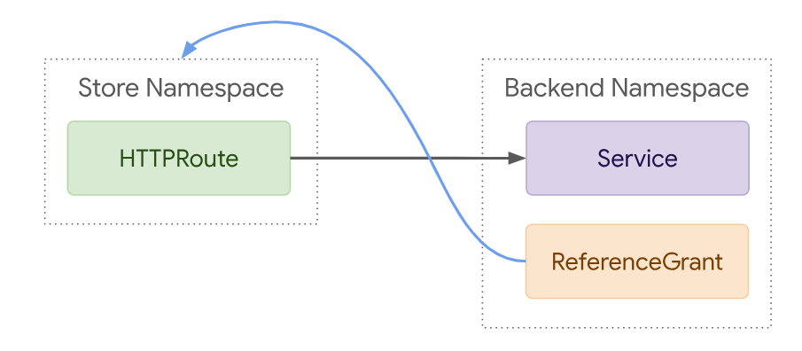

## Gateway API


### GatewayClass

[GatewayClass](https://gateway-api.sigs.k8s.io/reference/spec/#gateway.networking.k8s.io/v1beta1.GatewayClass)是由基础设施提供商定义的集群范围的资源。该资源代表一类可以实例化的网关。建议将此资源用作Gateways的模板。这意味着Gateway基于创建时的GatewayClass状态，并且不会将GatewayClass或关联参数的更改传播到现有的Gateways。此建议旨在限制对GatewayClass或关联参数的更改的影响范围。如果实现选择将GatewayClass的更改传播到现有的Gateways，必须在实现文档中明确记录。每当一个或多个Gateways使用GatewayClass时，实现应该在关联的GatewayClass上添加*gateway-exists-finalizer.gateway.networking.k8s.io*finalizer。这确保了在使用中时不会删除与Gateway关联的GatewayClass。

> 注意: GatewayClass是一个集群级别的资源。


详细字段定义如下:
```yaml
apiVersion: gateway.networking.k8s.io/v1alpha2
kind: GatewayClass
metadata: # metadata字段参考Kubernetes metadata定义
  name: cluster-gateway-class
spec:
  # ControllerName 是管理此类网关的控制器的名称
  # 用于区分多个不同的网关控制器
  controllerName: "example.net/gateway-controller"
  # 用于配置GatewayClass的配置
  # 可以是自定义的CRD
  parametersRef:
    group: example.net/v1alpha1
    kind: Config
    name: internet-gateway-config
  description: |
    this is gateywa class
```


### Gateway


### ReferenceGrant 

ReferenceGrant可用于启用GatewayAPI内的**跨命名空间**引用。

主要是: 

+ Routes可以将流量转发到其他命名空间中的后端(例: Service)
+ Gateways可以引用另一个命名空间中的Secrets

过去我们发现，跨命名空间转发流量是一项期望的功能，但是如果没有像ReferenceGrant这样的保护措施，可能会出现漏洞。

如果对象被从其命名空间之外引用，那么对象的所有者必须创建一个ReferenceGrant资源来明确允许该引用。没有ReferenceGrant，跨命名空间引用是无效的。



基本上，ReferenceGrant由两个列表组成，一个是引用可能来自的资源列表，另一个是可能被引用的资源列表。

+ from列表允许您指定可能引用to列表中描述的项目的资源的组、种类和命名空间。

+ to列表允许您指定可能被from列表中描述的项目引用的资源的组和种类。在to列表中，命名空间不是必需的，因为ReferenceGrant只能用于允许对与ReferenceGrant**相同命名空间**中的资源的引用。

例如:

以下foo namespace的HTTPRoute允许引用bar namespace的Service

```yaml
apiVersion: gateway.networking.k8s.io/v1alpha2
kind: HTTPRoute
metadata:
  name: foo
  namespace: foo
spec:
  rules:
  - matches:
    - path: /bar
    backendRefs:
      - name: bar
        namespace: bar
---
apiVersion: gateway.networking.k8s.io/v1alpha2
kind: ReferenceGrant
metadata:
  name: bar
  namespace: bar
spec:
  from:
  - group: gateway.networking.k8s.io
    kind: HTTPRoute
    namespace: foo
  to:
  - group: ""
    kind: Service
```


**API设计决策**

+ 每个ReferenceGrant仅支持单个From和To部分。必须使用额外的ReferenceGrant资源来建模附加的信任关系。
+ 资源名称被有意地排除在ReferenceGrant的"From"部分之外，因为它们很少提供任何有意义的保护。能够写入某个命名空间内某种资源的用户始终可以重命名资源或更改资源的结构以匹配给定的授予。
  每个“From”结构只允许一个命名空间。
+ 虽然选择器可能更强大，但它鼓励不必要的不安全配置。
  这些资源的效果纯粹是累加的，它们堆叠在一起。这使它们不可能相互冲突。


详细字段定义如下:

ReferenceGrant标识了其他命名空间中<u>信任于引用指定命名空间</u>中指定种类资源的资源种类。每个ReferenceGrant可以用来表示一个独特的信任关系。可以使用额外的ReferenceGrant来扩展被信任的入站引用源的集合，这些引用源位于其定义的命名空间内。在Gateway API中，对于所有跨命名空间引用，都需要一个ReferenceGrant（*Route-Gateway 附加跨命名空间的例外情况除外*，其受Gateway上的**AllowedRoutes**配置的控制，以及在"消费者"网格Route上的跨命名空间Service ParentRefs，该Route定义仅适用于在Route命名空间中的工作负载的路由规则）。允许从Route到Service的引用的ReferenceGrants仅适用于BackendRefs。

ReferenceGrant是一种运行时验证的形式，允许用户声明哪些跨命名空间对象引用是允许的。支持ReferenceGrant的实现不能允许没有授予的跨命名空间引用，并且必须对授予允许的访问的授予的删除做出响应，撤销该许可。

```yaml
apiVersion: gateway.networking.k8s.io/v1alpha2
kind: ReferenceGrant
metadata:
  name: ref-demo
  namespace: ref-demo
spec:
  # From部分描述了可以引用"To"中描述的资源的受信任命名空间和种类。
  # 列表中的每个条目都必须被视为可以从中引用的另一个位置,或者换句话说,这些条目必须使用OR组合
  from:
    - group: gateway.networking.k8s.io
      kind: HTTPRoute
      namespace: foo
  # To部分描述了可能被“From”中描述的资源引用的资源。
  # 列表中的每个条目都必须被视为引用可以有效到达的另一个位置,或者换句话说,这些条目必须使用OR组合
  to:
    - group: ""
      kind: Service
      # 可以不用显式配置namespace. 默认情况下认为ReferenceGrant只能用于允许对与ReferenceGrant**相同命名空间**
```

