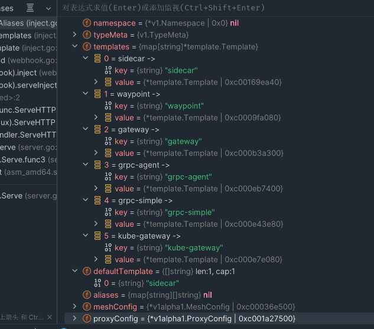

## Istio Debug

我们在后续的Istio源码阅读之旅中, 会阅读大量的源码. 我们可以在源码中看到执行逻辑, 但是有些上下文参数对象我们却看不到. 这个时候就需要我们能够有一种方式通过IDE进行远程调试.

Go提供了**Devle**工具可以让我们进行*remote debug*, 即istiod运行在k8s集群中我们依旧可以进行打断点的方式进行debug. 这方便了我们阅读源码, 同时让我们可以更好的看到代码中上下文环境的值.


首先我们拉取istio repository

```shell
$ git init
$ git pull https://github.com/istio/istio.git
```


随后我们对源码进行编译. 这将会把istio源码构建成一个可调试的镜像

```shell
$ make DEBUG=1 docker.pilot
```

> 最好在一台有加速器的主机上操作, 这过程会拉取gcr.io仓库的镜像, 有可能会导致超时
>
> 这里有个坑, 我第一次直接下载代码源文件, 然后执行make命令, 这会导致缺失tag的错误信息. 这个tag实际上会查找git revision的值. 所以我们通过git拉取代码再进行make构建

此时我们可以基于make构建出来的调试镜像, 构建一个含有**Devle**工具的镜像

这里我就简单的将Devle二进制文件拷贝进容器

```dockerfile
FROM registry.cn-guangzhou.aliyuncs.com/shyunn/istio-debug:1.20

WORKDIR /usr/local/bin/

COPY . .

EXPOSE 40000

ENTRYPOINT ["/usr/local/bin/dlv","--continue", "--accept-multiclient","--listen=:40000", "--check-go-version=false","--headless=true", "--api-version=2","--log=true", "--log-output=debugger,debuglineerr,gdbwire,lldbout,rpc","exec", "/usr/local/bin/pilot-discovery", "--"]
```

我们可以将镜像推送到私服中, 然后修改istiod Deployment资源文件

```shell
$ kubectl edit deployment istiod -n istio-system

# image修改为我们刚刚构建出来的镜像, 然后添加安全上下文配置, 让delve可以进行执行
# yaml
...
image: xxx  # 修改为自己构建的镜像
securityContext:
  allowPrivilegeEscalation: true
  capabilities:
    drop:
    - ALL
  readOnlyRootFilesystem: false
  runAsGroup: 1337
  runAsNonRoot: true
  runAsUser: 1337
...
```

最后我们将端口进行转发, 就可以在goland中配置remote debug了

```shell
$ kubectl port-forward -n istio-system --address 0.0.0.0 deployment/istiod 40000:40000
```


## Istio-iptables

这个组件是Istio进行注入时, 在initContainer中使用组件, 主要是用于对iptables路由表的更改

我们首先进入源码`/istio/istio-master/pilot/cmd/pilot-agent`目录对`main.go`进行编译, 编译出pilot-agent命令行工具.

此时可以直接在主机上进行测试, pilot-agent的istio-iptables实际上就是使用了iptables, 对Pod内的iptables nat表进行修改, 增加了不同的路由规则将入站流量重定向到15006端口, 出站流量重定向15001端口. 所有流量都交由Sidecar(Envoy)进行处理.


我们来看一下pilot-agent istio-iptables的flag参数:

```shell
istio-iptables is responsible for setting up port forwarding for Istio Sidecar.

Usage:
  pilot-agent istio-iptables [flags]

Flags:
      --capture-all-dns                             Instead of only capturing DNS traffic to DNS server IP, capture all DNS traffic at port 53. This setting is only effective when redirect dns is enabled.
      --cni-mode                                    Whether to run as CNI plugin.
      --drop-invalid                                Enable invalid drop in the iptables rules.
  -n, --dry-run                                     Do not call any external dependencies like iptables.
      --dual-stack                                  Enable ipv4/ipv6 redirects for dual-stack.
  -p, --envoy-port string                           Specify the envoy port to which redirect all TCP traffic. (default "15001")
  -h, --help                                        help for istio-iptables
  -z, --inbound-capture-port string                 Port to which all inbound TCP traffic to the pod/VM should be redirected to. (default "15006")
  -e, --inbound-tunnel-port string                  Specify the istio tunnel port for inbound tcp traffic. (default "15008")
      --iptables-probe-port uint16                  Set listen port for failure detection. (default 15002)
      --iptables-trace-logging                      Insert tracing logs for each iptables rules, using the LOG chain.
      --iptables-version string                     version of iptables command. If not set, this is automatically detected.
  -c, --istio-exclude-interfaces string             Comma separated list of NIC (optional). Neither inbound nor outbound traffic will be captured.
  -m, --istio-inbound-interception-mode string      The mode used to redirect inbound connections to Envoy, either "REDIRECT" or "TPROXY".
  -b, --istio-inbound-ports string                  Comma separated list of inbound ports for which traffic is to be redirected to Envoy (optional). The wildcard character "*" can be used to configure redirection for all ports. An empty list will disable.
  -t, --istio-inbound-tproxy-mark string             (default "1337")
  -r, --istio-inbound-tproxy-route-table string      (default "133")
  -d, --istio-local-exclude-ports string            Comma separated list of inbound ports to be excluded from redirection to Envoy (optional). Only applies when all inbound traffic (i.e. "*") is being redirected.
  -o, --istio-local-outbound-ports-exclude string   Comma separated list of outbound ports to be excluded from redirection to Envoy.
  -q, --istio-outbound-ports string                 Comma separated list of outbound ports to be explicitly included for redirection to Envoy.
  -i, --istio-service-cidr string                   Comma separated list of IP ranges in CIDR form to redirect to envoy (optional). The wildcard character "*" can be used to redirect all outbound traffic. An empty list will disable all outbound.
  -x, --istio-service-exclude-cidr string           Comma separated list of IP ranges in CIDR form to be excluded from redirection. Only applies when all  outbound traffic (i.e. "*") is being redirected.
  -k, --kube-virt-interfaces string                 Comma separated list of virtual interfaces whose inbound traffic (from VM) will be treated as outbound.
      --network-namespace string                    The network namespace that iptables rules should be applied to.
      --probe-timeout duration                      Failure detection timeout. (default 5s)
  -g, --proxy-gid string                            Specify the GID of the user for which the redirection is not applied (same default value as -u param).
  -u, --proxy-uid string                            Specify the UID of the user for which the redirection is not applied. Typically, this is the UID of the proxy container.
      --redirect-dns                                Enable capture of dns traffic by istio-agent.
  -f, --restore-format                              Print iptables rules in iptables-restore interpretable format. (default true)
      --run-validation                              Validate iptables.
      --skip-rule-apply                             Skip iptables apply.

Global Flags:
      --log_as_json                   Whether to format output as JSON or in plain console-friendly format
      --log_caller string             Comma-separated list of scopes for which to include caller information, scopes can be any of [ads, adsc, all, authn, authorization, ca, cache, citadelclient, controllers, default, delta, dns, gateway, gcecred, googleca, googlecas, grpcgen, healthcheck, ingress status, iptables, klog, kube, mockcred, model, monitoring, retry, sds, security, serviceentry, spiffe, status, stsclient, stsserver, token, trustBundle, validation, wasm, wle, xdsproxy]
      --log_output_level string       Comma-separated minimum per-scope logging level of messages to output, in the form of <scope>:<level>,<scope>:<level>,... where scope can be one of [ads, adsc, all, authn, authorization, ca, cache, citadelclient, controllers, default, delta, dns, gateway, gcecred, googleca, googlecas, grpcgen, healthcheck, ingress status, iptables, klog, kube, mockcred, model, monitoring, retry, sds, security, serviceentry, spiffe, status, stsclient, stsserver, token, trustBundle, validation, wasm, wle, xdsproxy] and level can be one of [debug, info, warn, error, fatal, none] (default "default:info")
      --log_rotate string             The path for the optional rotating log file
      --log_rotate_max_age int        The maximum age in days of a log file beyond which the file is rotated (0 indicates no limit) (default 30)
      --log_rotate_max_backups int    The maximum number of log file backups to keep before older files are deleted (0 indicates no limit) (default 1000)
      --log_rotate_max_size int       The maximum size in megabytes of a log file beyond which the file is rotated (default 104857600)
      --log_stacktrace_level string   Comma-separated minimum per-scope logging level at which stack traces are captured, in the form of <scope>:<level>,<scope:level>,... where scope can be one of [ads, adsc, all, authn, authorization, ca, cache, citadelclient, controllers, default, delta, dns, gateway, gcecred, googleca, googlecas, grpcgen, healthcheck, ingress status, iptables, klog, kube, mockcred, model, monitoring, retry, sds, security, serviceentry, spiffe, status, stsclient, stsserver, token, trustBundle, validation, wasm, wle, xdsproxy] and level can be one of [debug, info, warn, error, fatal, none] (default "default:none")
      --log_target stringArray        The set of paths where to output the log. This can be any path as well as the special values stdout and stderr (default [stdout])
      --vklog Level                   number for the log level verbosity. Like -v flag. ex: --vklog=9
```

看到上面的参数, 是不是感觉头都大了. 我们掌握几个常用的参数是如何使用

```shell
istio-iptables is responsible for setting up port forwarding for Istio Sidecar.

Usage:
  pilot-agent istio-iptables [flags]

Flags:
--capture-all-dns  # 不是仅捕获到DNS服务器IP的DNS流量, 而是捕获端口53处的所有DNS流量. 此设置仅在启用重定向DNS时有效
--cni-mode  # 是否作为CNI插件进行运行
--drop-invalid  # 在iptables开启无效drop
-n, --dry-run   # 不要调用任何外部依赖项，例如iptables
--dual-stack    # 开启ipv4/ipv6双栈重定向
-p, --envoy-port string  # 指定将所有TCP流量重定向到envoy的端口, 例如出站流量. 默认为 15001
-z, --inbound-capture-port string  # 指定将所有入站的TCP流量重定向到envoy的端口. 默认为 15006
-e, --inbound-tunnel-port string   # 指定入站TCP流量的隧道端口. 默认为 15008
--iptables-probe-port uint16       # 故障检测的端口. 默认为 15002 (Probe探针配置)
--iptables-trace-logging  # 使用Log规则在每个istio设置的iptables规则上插入跟踪日志. (尽量不要开启, 这会导致cpu和存储的额外开销, 调试阶段可以开启)
--iptables-version string  # iptables的版本. 默认会自动进行检测
-c, --istio-exclude-interfaces string   # NIC列表, 入站和出站流量都不会对其进行捕获.
-m, --istio-inbound-interception-mode string # 入站流量重定向到Envoy的模式, 可选"REDIRECT/TPROXY". 默认使用TPROXY
-b, --istio-inbound-ports string  # 将入站流量重定向到Envoy的网络端口(就是访问哪些端口的流量将会被重定向). 使用"*"匹配所有端口, 空列表代表禁用. (默认是空列表)
-t, --istio-inbound-tproxy-mark string # 默认为1337
-r, --istio-inbound-tproxy-route-table string # 默认为133
-d, --istio-local-exclude-ports string  # 重定向到Envoy的入站流量排除的端口.(就是入站流量访问哪些端口将不会被重定向). 仅当所有入站端口("*")被重定向时才适用.
-o, --istio-local-outbound-ports-exclude string  # # 重定向到Envoy的出站流量排除的端口.(就是出站流量访问哪些端口将不会被重定向). 
-q, --istio-outbound-ports string  # 显式指定需要重定向到Envoy出站流量的端口
-i, --istio-service-cidr string  # 重定向到Envoy的出站流量CIDR IP地址,  使用"*"匹配所有端口
-x, --istio-service-exclude-cidr string # 排除重定向到Envoy的出站流量CIDR IP地址,  使用"*"匹配所有端口
-k, --kube-virt-interfaces string  # 虚拟接口列表, 其入站流量将视为出站流量
--network-namespace string  # 应用iptables规则的网络空间
--probe-timeout duration   # 故障检测超时(Probe探针配置)
-g, --proxy-gid string  # 不应用重定向的GID
-u, --proxy-uid string  # 不应用重定向的UID, 这一般是与容器UID相同.
--redirect-dns  # 开启istio-agent捕获DNS流量
-f, --restore-format  # 以iptables-resotre格式打印pilot-agent设置的iptbales规则
--run-validation # 验证iptables
--skip-rule-apply   # 跳过iptables应用

Global Flags:
--log_as_json  # 将日志输出格式化为JSON或普通控制台友好的格式
--log_output_level string   # 要输出的最小日志级别列表, 格式为 <scope>:<level>,<scope>:<level>,... scope可选值: [ads, adsc, all, authn, authorization, ca, cache, citadelclient, controllers, default, delta, dns, gateway, gcecred, googleca, googlecas, grpcgen, healthcheck, ingress status, iptables, klog, kube, mockcred, model, monitoring, retry, sds, security, serviceentry, spiffe, status, stsclient, stsserver, token, trustBundle, validation, wasm, wle, xdsproxy],  level可选值:  [debug, info, warn, error, fatal, none] (默认为 "default:info")
--log_target stringArray  # 日志输出的target. 这可以是任何路径以及特殊值stdout和stderr(默认是"Stdout")
--vklog Level  # 日志级别详细程度的数字。就像 -v 标志一样。例如：--vklog=9（默认“0”）
...
```

我们可以使用`--dry-run`看看pilot-agent会为我们生成哪些iptables规则

```shell
# 生成iptables规则
$ ./pilot-agent istio-iptables --log_as_json --dry-run
2023-12-19T13:10:05.770489Z     info    Istio iptables environment:
ENVOY_PORT=
INBOUND_CAPTURE_PORT=
ISTIO_INBOUND_INTERCEPTION_MODE=
ISTIO_INBOUND_TPROXY_ROUTE_TABLE=
ISTIO_INBOUND_PORTS=
ISTIO_OUTBOUND_PORTS=
ISTIO_LOCAL_EXCLUDE_PORTS=
ISTIO_EXCLUDE_INTERFACES=
ISTIO_SERVICE_CIDR=
ISTIO_SERVICE_EXCLUDE_CIDR=
ISTIO_META_DNS_CAPTURE=
INVALID_DROP=

2023-12-19T13:10:05.770540Z     info    Istio iptables variables:
IPTABLES_VERSION=
PROXY_PORT=15001
PROXY_INBOUND_CAPTURE_PORT=15006
PROXY_TUNNEL_PORT=15008
PROXY_UID=1337		# proxy uid和gid默认被设置为1337
PROXY_GID=1337
INBOUND_INTERCEPTION_MODE=
INBOUND_TPROXY_MARK=1337
INBOUND_TPROXY_ROUTE_TABLE=133
INBOUND_PORTS_INCLUDE=
INBOUND_PORTS_EXCLUDE=
OUTBOUND_OWNER_GROUPS_INCLUDE=*
OUTBOUND_OWNER_GROUPS_EXCLUDE=
OUTBOUND_IP_RANGES_INCLUDE=
OUTBOUND_IP_RANGES_EXCLUDE=
OUTBOUND_PORTS_INCLUDE=
OUTBOUND_PORTS_EXCLUDE=
KUBE_VIRT_INTERFACES=
ENABLE_INBOUND_IPV6=false
DUAL_STACK=false
DNS_CAPTURE=false
DROP_INVALID=false
CAPTURE_ALL_DNS=false
DNS_SERVERS=[],[]
NETWORK_NAMESPACE=
CNI_MODE=false
EXCLUDE_INTERFACES=

2023-12-19T13:10:05.770599Z     info    Running iptables-restore with the following input:
* nat
# 新增了4条自定义链
-N ISTIO_INBOUND
-N ISTIO_REDIRECT
-N ISTIO_IN_REDIRECT
-N ISTIO_OUTPUT
# pilot-agent设置的流量拦截规则
-A ISTIO_INBOUND -p tcp --dport 15008 -j RETURN
-A ISTIO_REDIRECT -p tcp -j REDIRECT --to-ports 15001
-A ISTIO_IN_REDIRECT -p tcp -j REDIRECT --to-ports 15006
-A OUTPUT -p tcp -j ISTIO_OUTPUT
-A ISTIO_OUTPUT -o lo -s 127.0.0.6/32 -j RETURN
-A ISTIO_OUTPUT -o lo ! -d 127.0.0.1/32 -p tcp ! --dport 15008 -m owner --uid-owner 1337 -j ISTIO_IN_REDIRECT
-A ISTIO_OUTPUT -o lo -m owner ! --uid-owner 1337 -j RETURN
-A ISTIO_OUTPUT -m owner --uid-owner 1337 -j RETURN
-A ISTIO_OUTPUT -o lo ! -d 127.0.0.1/32 -p tcp ! --dport 15008 -m owner --gid-owner 1337 -j ISTIO_IN_REDIRECT
-A ISTIO_OUTPUT -o lo -m owner ! --gid-owner 1337 -j RETURN
-A ISTIO_OUTPUT -m owner --gid-owner 1337 -j RETURN
-A ISTIO_OUTPUT -d 127.0.0.1/32 -j RETURN
COMMIT
2023-12-19T13:10:05.770614Z     info    iptables-restore --noflush
2023-12-19T13:10:05.770618Z     info    Running ip6tables-restore with the following input:

2023-12-19T13:10:05.770621Z     info    ip6tables-restore --noflush
2023-12-19T13:10:05.770626Z     info    iptables-save 
2023-12-19T13:10:05.770629Z     info    skipping configuring routes due to dry run mode
```

实际上在Pod, istio首先通过initContainer容器对Pod的iptables定义对应的流量拦截规则, 与istio在Pod中注入的Envoy Sidecar一起工作, 形成了入站出站流量劫持功能(将流量都交由Istio的数据面(Envoy)进行处理). 

> 有可能你会对这些默认端口很迷惑, 并不知道这些端口是干啥用的. 这里有[传送门](https://istio.io/latest/zh/docs/ops/deployment/requirements/), 你可以查阅一下对应的端口是干什么的.


我们有了上面对`pilot-agent istio-iptables`用法的讲解, 接下来我们直接看一下实际上istio注入的initContainer是如何使用的

```yaml
# 准备一个简单的Pod.yaml
apiVersion: v1
kind: Pod
metadata:
  name: hellopod
spec:
  containers:
    - name: hello
      image: "fake.docker.io/google-samples/hello-go-gke:1.0"
      ports:
        - name: http
          containerPort: 80
---
# 应用在istio mesh后, 我们查看该Pod的yaml
apiVersion: v1
kind: Pod
metadata:
  annotations:
    ...
  labels:
    ...
  name: hellopod
spec:
  containers:
  ...
  
  # initContainer (用于初始化iptables的容器)
  initContainers:
  - args:
    - istio-iptables
    - -p
    - "15001"
    - -z
    - "15006"
    - -u
    - "1337"
    - -m
    - REDIRECT
    - -i
    - '*'
    - -x
    - ""
    - -b
    - '*'
    - -d
    - 15090,15021,15020
    - --log_output_level=default:info
    image: gcr.io/istio-testing/proxyv2:latest
    name: istio-init
    resources:
      limits:
        cpu: "2"
        memory: 1Gi
      requests:
        cpu: 100m
        memory: 128Mi
    securityContext:
      allowPrivilegeEscalation: false
      capabilities:
        add:
        - NET_ADMIN
        - NET_RAW
        drop:
        - ALL
      privileged: false
      readOnlyRootFilesystem: false
      runAsGroup: 0
      runAsNonRoot: false
      runAsUser: 0
...
```

istio自动注入了initContainers配置, 我们从该initContainers启动参数可以看到. pilot-agent在Pod的init阶段对Pod内网络iptables做了以下操作:

```shell
# initContainer的启动命令和参数等价于下列
$ pilot-agent istio-iptables -p "15001" -z "15006" -u "1337" -m REDIRECT -i '*' -x "" -b '*' -d 15090,15021,15020 --log_output_level=default:info

# 我们可以使用--dry-run看一下其定义的iptables规则
$ pilot-agent istio-iptables -p "15001" -z "15006" -u "1337" -m REDIRECT -i '*' -x "" -b '*' -d 15090,15021,15020 --log_output_level=default:info --dry-run

# 我们只看iptables规则部分
* nat
# pilot创建的四张表
-N ISTIO_INBOUND
-N ISTIO_REDIRECT
-N ISTIO_IN_REDIRECT
-N ISTIO_OUTPUT

# istio进行流量劫持的规则
-A ISTIO_INBOUND -p tcp --dport 15008 -j RETURN
-A ISTIO_REDIRECT -p tcp -j REDIRECT --to-ports 15001
-A ISTIO_IN_REDIRECT -p tcp -j REDIRECT --to-ports 15006
-A PREROUTING -p tcp -j ISTIO_INBOUND
-A ISTIO_INBOUND -p tcp --dport 15090 -j RETURN
-A ISTIO_INBOUND -p tcp --dport 15021 -j RETURN
-A ISTIO_INBOUND -p tcp --dport 15020 -j RETURN
# +将15090,15020,15021,15008端口以外的流量全部重定向到15006
-A ISTIO_INBOUND -p tcp -j ISTIO_IN_REDIRECT
-A OUTPUT -p tcp -j ISTIO_OUTPUT
-A ISTIO_OUTPUT -o lo -s 127.0.0.6/32 -j RETURN
-A ISTIO_OUTPUT -o lo ! -d 127.0.0.1/32 -p tcp ! --dport 15008 -m owner --uid-owner 1337 -j ISTIO_IN_REDIRECT
-A ISTIO_OUTPUT -o lo -m owner ! --uid-owner 1337 -j RETURN
# Envoy代理的"真实"出站流量, 将其直接路由出去
-A ISTIO_OUTPUT -m owner --uid-owner 1337 -j RETURN
-A ISTIO_OUTPUT -m owner --gid-owner 1337 -j RETURN
-A ISTIO_OUTPUT -o lo ! -d 127.0.0.1/32 -p tcp ! --dport 15008 -m owner --gid-owner 1337 -j ISTIO_IN_REDIRECT
-A ISTIO_OUTPUT -o lo -m owner ! --gid-owner 1337 -j RETURN
-A ISTIO_OUTPUT -d 127.0.0.1/32 -j RETURN
# 将所有出站流量重定向到15001
-A ISTIO_OUTPUT -j ISTIO_REDIRECT
COMMIT
```

> 我们可以将上述命令解释为: pilot-agent设置了以下的iptables规则. 出站流量都重定向Envoy的15001端口, 入站的流量都重定向Envoy的15006端口, 使用重定向的方式将入站流量转至Envoy, 所有的出站流量的IP网段都将重定向到Envoy, 所有的入站流量都重定向到Envoy, 同时排除15090,15021,15020端口入站流量的重定向, 将用户UID设置为1337.
>
> 在Istio注入的Sidecar或者initContainer中, **UID/GID都喜欢使用1337**.
>
> 上述规则中端口含义如下:
>
> + 15008: HBONE mTLS 隧道端口
> + 15001: Envoy 出站
> + 15006: Envoy 入站
> + 15090: 用于安全网络的 HBONE 端口
> + 15020: 从Istio代理、Envoy和应用程序合并的Prometheus遥测
> + 15021: 健康检查


## Istio proxy接管流量

我们了解了`pilot-agent`是通过修改iptables的规则进行对应的流量劫持, 那么此时我们也会很好奇. 当流量劫持到istio-proxy(下文描述为Envoy)后, Envoy是如何处理对应的**INBOUND**和**OUTBOUND**。实际上,Envoy通过控制平面下发的XDS配置进行动态的监听流量, 路由流量等.


### INBOUND

我们先来看一下Envoy是如何路由iptables重定向的流量到应用上, 我们也可以理解这一过程为INBOUND. 我们将使用Envoy+httpbin充当应用容器和Sidecar Proxy容器.

可以看到, 我们在initContainer中使用了pilot-agent对iptables规则进行修改, 以做到流量劫持到envoyproxy上.

```yaml
apiVersion: v1
kind: Pod
metadata:
  name: mock-init-pod
  namespace: mesh
  labels:
    kubernetes.io.mesh: mock-pod
spec:
  initContainers:
  - args:
    - istio-iptables
    - -p
    - "15001"
    - -z
    - "15006"
    - -u
    - "1337"
    - -m
    - REDIRECT
    - -i
    - '*'
    - -x
    - ""
    - -b
    - '*'
    - -d
    - 15090,15021,15020
    - --log_output_level=default:info
    image: docker.io/istio/proxyv2:1.20.1
    name: istio-init
    resources:
      limits:
        cpu: "2"
        memory: 1Gi
      requests:
        cpu: 100m
        memory: 128Mi
    securityContext:
      allowPrivilegeEscalation: false
      capabilities:
        add:
        - NET_ADMIN
        - NET_RAW
        drop:
        - ALL
      privileged: false
      readOnlyRootFilesystem: false
      runAsGroup: 0
      runAsNonRoot: false
      runAsUser: 0
  containers:
  - image: docker.io/kong/httpbin
    name: httpbin
    ports:
    - containerPort: 80
      name: http
  - name: envoyproxy
    image: envoyproxy/envoy-alpine:v1.21.0
    imagePullPolicy: IfNotPresent
    securityContext:
      allowPrivilegeEscalation: false
      capabilities:
        drop:
        - ALL
      privileged: false
      readOnlyRootFilesystem: true
      runAsGroup: 1337
      runAsNonRoot: true
      runAsUser: 1337
    volumeMounts:
      - name: envoyconfig
        mountPath: /etc/envoy/
  volumes:
    - name: envoyconfig
      configMap:
        defaultMode: 0655
        name: envoyconfig
```

重点是看一下Envoy的配置:

**主要流程:** 我们监听`0.0.0.0:15006`端口的流量, 当外部访问httpbin的INBOUND流量进来后, 首先重定向到Envoy监听的`0.0.0.0:15006`端口, 在处理filter_chains之前, 流量首先被listener_filters(其中filters的**定义顺序**很重要!)处理. 

listener_filters中就3个过滤器:

+ 获取流量的原始目的地(这是因为流量被重定向之后, Envoy后续路由并不知道流量原始的目的地是哪里, 所以需要通过socket信息获取流量的原始目的地)
+ 检测是TLS还是明文传输
+ 检测是否是HTTP协议

后续两个过滤器是为了能够在后续filter_chains中的filter_chain_match可以进行选择和匹配。

然后在filter_chains中的第一个过滤器匹配目标端口为80(流量已经被*恢复*成原始目的地了), 进行路由匹配到集群上, 集群类型配置为`type: ORIGINAL_DST`, 让Envoy代理到原始目的地(PodIP)上. 你还应该注意到 `upstreamBindConfig.sourceAddress.address` 的值被改写为了 `127.0.0.6`，而且对于 Pod 内流量是通过 `lo` 网卡发送的，这刚好呼应了上文中的 iptables `ISTIO_OUTPUT` 链中的第一条规则，根据该规则，流量将被透传到 Pod 内的应用容器

```yaml
apiVersion: v1
kind: ConfigMap
metadata:
  name: envoyconfig
  namespace: mesh
data:
  envoy.yaml: |
    static_resources:
      listeners:
        - name: listener_0
          address:
            socket_address: 
              address: 0.0.0.0
              port_value: 15006
          traffic_direction: INBOUND
          # 代替use_destination_port!!!
          # 侦听器过滤器有机会操纵和扩充用于连接过滤器链匹配的连接元数据
          # ⭐ listener_filters在filter_chains执行前进行执行
          # ⭐ 顺序很重要, 因为在listener接收socket之后、创建连接之前,listener_filters会按顺序处理
          listener_filters:
            # 使用原始目的地址(original dst address)
            # 因为iptables将目的地址进行重定向了, 我们需要通过socket获取原始的目的端口和地址
            # (我们可以在listener级别使用use_original_dst)
            - name: envoy.filters.listener.original_dst
              typed_config:
                '@type': type.googleapis.com/envoy.extensions.filters.listener.original_dst.v3.OriginalDst
            # 用于禁用过滤器的可选匹配谓词。当该字段为空时，过滤器启用
            - filter_disabled:
                # 左闭右开[start,end)
                # 匹配15006端口
                destination_port_range:
                  end: 15007
                  start: 15006
              # 用于检测连接是TLS还是明文, 可以在FilterChainMatch中进行对应的匹配和选择, 还可以生成对应的HTTP statistic统计数据
              name: envoy.filters.listener.tls_inspector
              typed_config:
                '@type': type.googleapis.com/envoy.extensions.filters.listener.tls_inspector.v3.TlsInspector
            # 用于禁用过滤器的可选匹配谓词。当该字段为空时，过滤器启用
            - filter_disabled:
                # 或逻辑匹配, 有一个匹配都可
                or_match:
                  rules:
                    - destination_port_range:
                        end: 81
                        start: 80172.16.247.36
                    - destination_port_range:
                        end: 15007
                        start: 15006
              # 检测协议是否为HTTP
              # Inspector检测出对应的协议之后, 可以在FilterChainMatch中进行对应的匹配和选择, 还可以生成对应的HTTP statistic统计数据
              name: envoy.filters.listener.http_inspector
              typed_config:
                '@type': type.googleapis.com/envoy.extensions.filters.listener.http_inspector.v3.HttpInspector
          listener_filters_timeout: 0s
          filter_chains:
            - filter_chain_match:
                destination_port: 80
                transport_protocol: raw_buffer
              name: inbound|80|listener
              filters:
                - name: envoy.filters.network.http_connection_manager
                  typed_config:
                    "@type": type.googleapis.com/envoy.extensions.filters.network.http_connection_manager.v3.HttpConnectionManager
                    stat_prefix: ingress_http
                    upgrade_configs:
                      - upgrade_type: websocket
                    codec_type: AUTO
                    use_remote_address: false
                    normalize_path: true
                    path_with_escaped_slashes_action: KEEP_UNCHANGED
                    access_log:
                    - name: envoy.access_loggers.stdout
                      typed_config:
                        "@type": type.googleapis.com/envoy.extensions.access_loggers.stream.v3.StdoutAccessLog
                    route_config:
                      name: inbound||80
                      validate_clusters: false
                      virtual_hosts:
                        - name: inbound|http|80
                          domains: ["*"]
                          routes:
                            - match: 
                                prefix: /
                              route:
                                cluster: inbound|80|
                    http_filters:
                      - name: envoy.filters.http.router
                        typed_config:
                          '@type': type.googleapis.com/envoy.extensions.filters.http.router.v3.Router
      clusters:
        - name: inbound|80|
          common_lb_config: {}
          connect_timeout: 1s
          type: ORIGINAL_DST
          lbPolicy: CLUSTER_PROVIDED
          upstream_bind_config:
            source_address:
              address: 127.0.0.6  
              portValue: 0
```


### TODO: OUTBOUND


outbound也是一样操作的, 只是配置了

OUTBOUND:

```yaml
apiVersion: v1
kind: ConfigMap
metadata:
  name: envoyconfig
  namespace: mesh
data:
  envoy.yaml: |
    static_resources:
      listeners:
        - name: listener_0
          address:
            socket_address:
              address: 0.0.0.0
              port_value: 15001
          name: virtualOutbound
          traffic_direction: OUTBOUND
          use_original_dst: true
          filter_chains:
          - name: virtualOutbound-catchall-tcp
            filters:
            - name: envoy.filters.network.tcp_proxy
              typed_config:
                '@type': type.googleapis.com/envoy.extensions.filters.network.tcp_proxy.v3.TcpProxy
                cluster: PassthroughCluster
                stat_prefix: PassthroughCluster
        - name: listener_1
          address:
            socket_address: 
              address: 0.0.0.0
              port_value: 15006
          traffic_direction: INBOUND
          # 代替use_destination_port!!!
          # 侦听器过滤器有机会操纵和扩充用于连接过滤器链匹配的连接元数据
          # ⭐ listener_filters在filter_chains执行前进行执行
          # ⭐ 顺序很重要, 因为在listener接收socket之后、创建连接之前,listener_filters会按顺序处理
          listener_filters:
            # 使用原始目的地址(original dst address)
            # 因为iptables将目的地址进行重定向了, 我们需要通过socket获取原始的目的端口和地址
            # (我们可以在listener级别使用use_original_dst)
            - name: envoy.filters.listener.original_dst
              typed_config:
                '@type': type.googleapis.com/envoy.extensions.filters.listener.original_dst.v3.OriginalDst
            # 用于禁用过滤器的可选匹配谓词。当该字段为空时，过滤器启用
            - filter_disabled:
                # 左闭右开[start,end)
                # 匹配15006端口
                destination_port_range:
                  end: 15007
                  start: 15006
              # 用于检测连接是TLS还是明文, 可以在FilterChainMatch中进行对应的匹配和选择, 还可以生成对应的HTTP statistic统计数据
              name: envoy.filters.listener.tls_inspector
              typed_config:
                '@type': type.googleapis.com/envoy.extensions.filters.listener.tls_inspector.v3.TlsInspector
            # 用于禁用过滤器的可选匹配谓词。当该字段为空时，过滤器启用
            - filter_disabled:
                # 或逻辑匹配, 有一个匹配都可
                or_match:
                  rules:
                    - destination_port_range:
                        end: 81
                        start: 80
                    - destination_port_range:
                        end: 15007
                        start: 15006
              # 检测协议是否为HTTP
              # Inspector检测出对应的协议之后, 可以在FilterChainMatch中进行对应的匹配和选择, 还可以生成对应的HTTP statistic统计数据
              name: envoy.filters.listener.http_inspector
              typed_config:
                '@type': type.googleapis.com/envoy.extensions.filters.listener.http_inspector.v3.HttpInspector
          listener_filters_timeout: 0s
          filter_chains:
            - filter_chain_match:
                destination_port: 80
                transport_protocol: raw_buffer
              name: inbound|80|listener
              filters:
                - name: envoy.filters.network.http_connection_manager
                  typed_config:
                    "@type": type.googleapis.com/envoy.extensions.filters.network.http_connection_manager.v3.HttpConnectionManager
                    stat_prefix: ingress_http
                    upgrade_configs:
                      - upgrade_type: websocket
                    codec_type: AUTO
                    use_remote_address: false
                    normalize_path: true
                    path_with_escaped_slashes_action: KEEP_UNCHANGED
                    access_log:
                    - name: envoy.access_loggers.stdout
                      typed_config:
                        "@type": type.googleapis.com/envoy.extensions.access_loggers.stream.v3.StdoutAccessLog
                    route_config:
                      name: inbound||80
                      validate_clusters: false
                      virtual_hosts:
                        - name: inbound|http|80
                          domains: ["*"]
                          routes:
                            - match: 
                                prefix: /
                              route:
                                cluster: inbound|80|
                    http_filters:
                      - name: envoy.filters.http.router
                        typed_config:
                          '@type': type.googleapis.com/envoy.extensions.filters.http.router.v3.Router
      clusters:
        - name: inbound|80|
          common_lb_config: {}
          connect_timeout: 1s
          type: ORIGINAL_DST
          lbPolicy: CLUSTER_PROVIDED
          upstream_bind_config:
            source_address:
              address: 127.0.0.6  
              portValue: 0  
        - name: PassthroughCluster
          connect_timeout: 1s
          type: ORIGINAL_DST
          lbPolicy: CLUSTER_PROVIDED
          typed_extension_protocol_options:
            envoy.extensions.upstreams.http.v3.HttpProtocolOptions:
              '@type': type.googleapis.com/envoy.extensions.upstreams.http.v3.HttpProtocolOptions
              common_http_protocol_options:
                idle_timeout: 300s
              use_downstream_protocol_config:
                http_protocol_options: {}
                http2_protocol_options: {}
```


## Istio Injector分析

Istio可以配置成自动向Pod注入sidecar容器和init容器, 使Pod加入ServiceMesh中.

其中Istio使用Kubernetes的MutatingWebhook进行自动注入. 

我们来看一下Istio中关于自动注入的Injector Webhook源码


### NewWebhook

主要功能:

+ 创建webhook实例
+ 获取sidecar注入相关配置
+ 创建一个Multicast广播(可以在一个Watcher上执行多个回调handler)
+ 添加一个监听配置(sidecarConfig,valuesConfig,meshConfig)变更的handler
+ 注册webhook的端点

```go
func NewWebhook(p WebhookParameters) (*Webhook, error) {
	...
    
	// 1. 创建一个webhook
	wh := &Webhook{
		watcher:    p.Watcher,
		meshConfig: p.Env.Mesh(),
		env:        p.Env,
		revision:   p.Revision,
	}
	
    ...
    
	// TODO 2. 创建一个广播
	mc := NewMulticast(p.Watcher, wh.GetConfig)

	// TODO 3. 添加一个配置变更时进行处理的handler
	mc.AddHandler(wh.updateConfig)
	
	wh.MultiCast = mc

	// TODO 4. 获取要注入的sidecar和values配置
	sidecarConfig, valuesConfig, err := p.Watcher.Get()
	if err != nil {
		return nil, err
	}

	// 5. 将sidecar配置和valuesConfig设置到webhook
	if err := wh.updateConfig(sidecarConfig, valuesConfig); err != nil {
		log.Errorf("failed to process webhook config: %v", err)
	}

	// 6. 注册自动sidecar注入的MutatingWebhook的端点
	p.Mux.HandleFunc("/inject", wh.serveInject)
	p.Mux.HandleFunc("/inject/", wh.serveInject)

	// TODO 7. 注册一个meshConfig修改时的回调handler
	p.Env.Watcher.AddMeshHandler(func() {
		wh.mu.Lock()
        // 将新的meshConfig设置到webhook的meshConfig上
		wh.meshConfig = p.Env.Mesh()
		wh.mu.Unlock()
	})

	return wh, nil
}
```


### serveInject

主要功能:

+ 读取请求体数据
+ 检查请求数据格式是否为JSON
+ 将请求体的内容反序列化为AdmissionReview
+ 调用`inject`方法
+ 设置AdmissionReview返回值的元数据以及patch
+ 将AdmissionReview返回给api-server

```go
func (wh *Webhook) serveInject(w http.ResponseWriter, r *http.Request) {

	// injector Counter指标计数+1
	totalInjections.Increment()
	// injector Duration指标计数
	t0 := time.Now()
	defer func() { injectionTime.Record(time.Since(t0).Seconds()) }()

	// 1. 读取请求体数据
	var body []byte
	if r.Body != nil {
		// 读取kubernetes限制大小的请求体数据
		if data, err := kube.HTTPConfigReader(r); err == nil {
			body = data
		} else {
			http.Error(w, err.Error(), http.StatusBadRequest)
			return
		}

	}
	if len(body) == 0 {
		handleError("no body found")
		http.Error(w, "no body found", http.StatusBadRequest)
		return
	}

	// verify the content type is accurate
	// 2. 检查内容类型是否准确
	contentType := r.Header.Get("Content-Type")
	if contentType != "application/json" {
		handleError(fmt.Sprintf("contentType=%s, expect application/json", contentType))
		http.Error(w, "invalid Content-Type, want `application/json`", http.StatusUnsupportedMediaType)
		return
	}

	path := ""
	if r.URL != nil {
		path = r.URL.Path
	}

	var reviewResponse *kube.AdmissionResponse
	var obj runtime.Object
	var ar *kube.AdmissionReview

	// 3. 反序列化成k8s Object
	if out, _, err := deserializer.Decode(body, nil, obj); err != nil {
		handleError(fmt.Sprintf("Could not decode body: %v", err))
		reviewResponse = toAdmissionResponse(err)
	} else {
		log.Debugf("AdmissionRequest for path=%s\n", path)

		// 将k8s obj转为 AdmissionReview
		ar, err = kube.AdmissionReviewKubeToAdapter(out)
		if err != nil {
			handleError(fmt.Sprintf("Could not decode object: %v", err))
			reviewResponse = toAdmissionResponse(err)
		} else {

			// ⭐ 调用webhook的inject方法
			reviewResponse = wh.inject(ar, path)
		}
	}

	// api-server发送一个AdmissionReview给webhook
	// webhook也返回一个AdmissionReview给api-server
	// (需要是版本相同的AdmissionReview)

	// 4. 设置AdmissionReview.Response所需的数据
	response := kube.AdmissionReview{}
	response.Response = reviewResponse
	var responseKube runtime.Object
	var apiVersion string
	if ar != nil {
		apiVersion = ar.APIVersion
		response.TypeMeta = ar.TypeMeta
		if response.Response != nil {
			if ar.Request != nil {
				//必须设置为请求的UID
				response.Response.UID = ar.Request.UID
			}
		}
	}

	// 将AdmissionReview转为K8s.object, 并进行JSON序列化
	responseKube = kube.AdmissionReviewAdapterToKube(&response, apiVersion)
	resp, err := json.Marshal(responseKube)
	if err != nil {
		log.Errorf("Could not encode response: %v", err)
		http.Error(w, fmt.Sprintf("could not encode response: %v", err), http.StatusInternalServerError)
		return
	}

	// 5. 将AdmissionReview JSON数据写入响应中, 至此inject流程全部完成
	if _, err := w.Write(resp); err != nil {
		log.Errorf("Could not write response: %v", err)
		http.Error(w, fmt.Sprintf("could not write response: %v", err), http.StatusInternalServerError)
	}
}
```


### inject

主要功能:

+ 反序列化AdmissionReview.request.object的请求对象(Pod)
+ 处理Pod潜在的空字段
+ 判断该Pod是否需要执行Inject动作
+ 设置Pod一些元数据
+ 初始化InjectionParameters注入动作的参数对象, 调用`injectPod`(核心方法: 执行注入的逻辑函数)
+ 构建AdmissionResponse, 并设置注入后的JSON Patch

```go
func (wh *Webhook) inject(ar *kube.AdmissionReview, path string) *kube.AdmissionResponse {

	req := ar.Request
	var pod corev1.Pod

	// 1. 反序列化AdmissionReview.request.object中请求对象
	if err := json.Unmarshal(req.Object.Raw, &pod); err != nil {
		handleError(fmt.Sprintf("Could not unmarshal raw object: %v %s", err,
			string(req.Object.Raw)))
		return toAdmissionResponse(err)
	}

	// 2. 处理Pod潜在的空字段(name,namespace)
	// Managed fields is sometimes extremely large, leading to excessive CPU time on patch generation
	// It does not impact the injection output at all, so we can just remove it.
	// managed fields是一个遗留字段, 这对inject并没有作用, 同时还会增加cpu负载
	pod.ManagedFields = nil
	// Deal with potential empty fields, e.g., when the pod is created by a deployment
	// 处理潜在的空字段，例如，当部署创建pod时
	podName := potentialPodName(pod.ObjectMeta)
	if pod.ObjectMeta.Namespace == "" {
		pod.ObjectMeta.Namespace = req.Namespace
	}
	log.Infof("Sidecar injection request for %v/%v", req.Namespace, podName)
	log.Debugf("Object: %v", string(req.Object.Raw))
	log.Debugf("OldObject: %v", string(req.OldObject.Raw))

	wh.mu.RLock()

	// 3. 判断该pod是否需要执行注入injector
	if !injectRequired(IgnoredNamespaces.UnsortedList(), wh.Config, &pod.Spec, pod.ObjectMeta) {

		// 这个pod不需要被注入了(label/annotation)不满足注入规则, 直接返回response
		log.Infof("Skipping %s/%s due to policy check", pod.ObjectMeta.Namespace, podName)
		totalSkippedInjections.Increment()
		wh.mu.RUnlock()
		return &kube.AdmissionResponse{
			Allowed: true,
		}
	}

	// 4. TODO: 获取Sidecar的Proxy Config
	proxyConfig := wh.env.GetProxyConfigOrDefault(pod.Namespace, pod.Labels, pod.Annotations, wh.meshConfig)

	// 5. 获取Pod的Deploy元数据, 设置podNamespace
	deploy, typeMeta := kube.GetDeployMetaFromPod(&pod)
	var podNamespace *corev1.Namespace
	if wh.namespaces != nil {
		podNamespace = wh.namespaces.Get(pod.Namespace, "")
	}

	// ⭐ 6. 初始化 Inject所需的参数对象 InjectionParameters
	params := InjectionParameters{
		pod:                 &pod,
		deployMeta:          deploy,
		namespace:           podNamespace,
		typeMeta:            typeMeta,
		templates:           wh.Config.Templates,
		defaultTemplate:     wh.Config.DefaultTemplates,
		aliases:             wh.Config.Aliases,
		meshConfig:          wh.meshConfig,
		proxyConfig:         proxyConfig,
		valuesConfig:        wh.valuesConfig,
		revision:            wh.revision,
		injectedAnnotations: wh.Config.InjectedAnnotations,
		proxyEnvs:           parseInjectEnvs(path),
	}
	wh.mu.RUnlock()

	// 7. ⭐ 实际注入Pod的函数
	patchBytes, err := injectPod(params)
	if err != nil {
		handleError(fmt.Sprintf("Pod injection failed: %v", err))
		return toAdmissionResponse(err)
	}

	// 8. 构建AdmissionResponse, 并设置JSON Patch
	reviewResponse := kube.AdmissionResponse{
		Allowed: true,
		Patch:   patchBytes,
		PatchType: func() *string {
			pt := "JSONPatch"
			return &pt
		}(),
	}
	totalSuccessfulInjections.Increment()
	return &reviewResponse
}
```


### injectPod(⭐)

**injectPod**是istio执行自动注入的核心方法, 其涵盖了自动注入的主要逻辑, 我们编写自定义注入的Webhook也可以借鉴其逻辑步骤

主要功能如下:

+ 检查Pod的DNS policy
+ 提前保留原始Pod(originalOldPod), 将与mergePod合并后作为响应返回给K8s
+ 运行注入模板
+ 重新应用且覆盖Containers
+ 应用一些额外的转换到Pod上(例如重写Probe探针, 设置Prometheus Labels, 重排列Containers等)
+ 最后将mergePod和originalPod合并后序列化为patch bytes, 返回给上层函数inject. inject将其设置进AdmissionReview.response中

```go
func injectPod(req InjectionParameters) ([]byte, error) {

	// 1. 检查Pod的DNS policy
	checkPreconditions(req)

    // 2. 提前保留原始Pod(originalOldPod), 将与mergePod合并后作为响应返回给K8s
	originalPodSpec, err := json.Marshal(req.pod)
	if err != nil {
		return nil, err
	}

	// 3. 运行注入模板
	mergedPod, injectedPodData, err := RunTemplate(req)
	if err != nil {
		return nil, fmt.Errorf("failed to run injection template: %v", err)
	}

	// TODO 4. 重新应用且覆盖Containers
	mergedPod, err = reapplyOverwrittenContainers(mergedPod, req.pod, injectedPodData)
	if err != nil {
		return nil, fmt.Errorf("failed to re apply container: %v", err)
	}

	// 5. 应用一些额外的转换到Pod上
	if err := postProcessPod(mergedPod, *injectedPodData, req); err != nil {
		return nil, fmt.Errorf("failed to process pod: %v", err)
	}

	// 6. 将mergePod和originalPod合并后序列化为patch
	patch, err := createPatch(mergedPod, originalPodSpec)
	if err != nil {
		return nil, fmt.Errorf("failed to create patch: %v", err)
	}

	log.Debugf("AdmissionResponse: patch=%v\n", string(patch))
	return patch, nil
}
```


istio-inject Param中的模板和默认模板如下图


