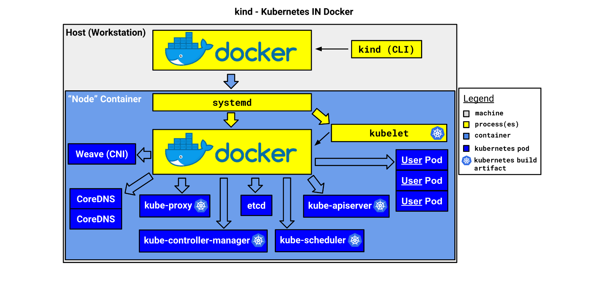

## Kind

### 基础概念

**Kind是什么?**

Kind,或称为Kubernetes in Docker,是一套用于本地Kubernetes"集群"的工具套件，其中每个"节点"都是一个Docker容器. Kind主要用于测试Kubernetes相关(K8s二开, K8s集群测试, K8s学习等).

Kind分为实现大部分功能的Go包、供用户使用的命令行工具以及一个"节点"基础镜像。其目标是使kind套件的各个包最终可以被其他工具（例如 kubetest）导入和重复使用，而命令行工具则提供了一种快速使用和调试这些包的方式。

简而言之，Kind专注于用于测试目的的本地集群。虽然并非所有的测试都可以在没有启用云提供商CCM（Cloud Controller Manager）的"真实"集群中进行,但足够多的测试可以在本地运行，因此我们需要一个具备以下特点的工具：

- 运行成本很低的集群，任何开发人员都可以在本地复制(本地起一个Kind集群所需要时间和成本都相当低, 我们可以快速且可复制的启动多个本地集群)
- 与我们的工具集成
- 充分记录和可维护
- 非常稳定，具有广泛的错误处理和健全性检查
- 通过所有一致性测试


**Kind架构图**

我们来看一张Kind在Docker中的架构图:

K8s集群所需要保证集群运行的集群组件都运行在`control-plane`容器上, 所以Kind可以以单节点方式启动, 也可以测试K8s功能, 但是




**Kind生命周期**

集群创建: 每个"节点"都作为一个Docker容器运行. 每个容器最初启动时处于伪"暂停"状态, 入口点等待SIGUSR1信号. 这使我们能够在启动systemd和所有组件之前，使用`docker exec ...`和其他工具操纵和检查容器。这个设置包括修复挂载点和预加载保存的Docker镜像。一旦节点准备就绪，我们向入口点发送信号，实际上"启动"节点。然后,我们等待节点上的Docker服务准备就绪，然后运行kubeadm初始化节点. 一旦kubeadm启动, 我们导出KUBECONFIG(让用户可以使用kubectl与集群交互),然后应用一个覆盖网络。此时,用户可以使用导出的kubeconfig进行Kubernetes测试.

集群删除: 集群中的所有"节点"容器都使用Docker标签进行标记, 该标签通过所选的集群名称(默认集群名称为kind, 可以通过命令行或者配置文件修改)标识集群, 要删除集群,我们只需列出并删除具有此标签的容器


### 安装

从上述kind的基础概念我们可以得知, kind运行是需要Docker(或Podman), 当前假设用户已经安装了相关容器工具.

**安装kind工具**:

如果你是一名Go开发者, 那么可以使用go进行安装

```shell
# 可以根据需求替换对应的版本
$ go install sigs.k8s.io/kind@v0.22.0
```

我们也可以通过下载二进制文件的方式安装

```shell
# 可以根据需求替换对应的版本
# For AMD64 / x86_64
$ [ $(uname -m) = x86_64 ] && curl -Lo ./kind https://kind.sigs.k8s.io/dl/v0.22.0/kind-linux-amd64
# For ARM64
$ [ $(uname -m) = aarch64 ] && curl -Lo ./kind https://kind.sigs.k8s.io/dl/v0.22.0/kind-linux-arm64
$ chmod +x ./kind
$ sudo mv ./kind /usr/local/bin/kind
```

**安装kubectl工具**

我们安装kubectl工具, 用于与kind创建的K8s集群进行交互

```shell
# 选择对应的平台
# amd64
$ curl -LO https://dl.k8s.io/release/v1.29.1/bin/linux/amd64/kubectl
# arm64
$ curl -LO https://dl.k8s.io/release/v1.29.1/bin/linux/arm64/kubectl

# 安装kubectl
$ install -o root -g root -m 0755 kubectl /usr/local/bin/kubectl
```


### 快速开始

**创建集群**

我们直接使用`kind create cluster`可以快速创建一个只有control-plane的单节点K8s(在大多数情况下已经够用了).

如果想要指定另一个镜像，请使用`--image` 标志，例如 `kind create cluster --image=...`. 使用不同的镜像允许您更改创建的集群的Kubernetes版本.

默认情况下，集群将被命名为"kind"。使用`--name`标志为集群指定不同的上下文名称。

如果您希望`create cluster`命令在控制平面达到就绪状态之前阻塞, 可以使用`--wait`标志并指定超时时间. 要使用`--wait`,您必须指定等待的时间单位. 例如,等待30秒,可以使用`--wait 30s`,等待5分钟, 可以使用`--wait 5m`等.


创建集群后, 我们可以通过kind生成的配置文件使用kubectl与其进行交互. 

默认情况下, 如果未设置$KUBECONFIG环境变量, 则集群访问配置存储在**${HOME}/.kube/config**中, 我们还可以使用`kind export kubeconfig`导出kubeconfig文件.


我们可以创建多个集群

```shell
# 创建2个集群
$ kind create cluster --name kind-1
$ kind create cluster --name kind-2
```

为了与特定集群交互, 我们只需在kubectl中指定集群名称作为上下文

```shell
$ kubectl cluster-info --context kind-1
$ kubectl cluster-info --context kind-2
```

查看kind创建的所有集群

```shell
$ kind get clusters
```


**删除集群**

我们通过kind创建了一个集群如此简单, 那么删除集群也同样简单, 使用`kind delete cluster`即可删除集群, 如果没有指定name, 则删除默认的集群.


**集群详细配置**

有些时候, 我们希望能够对kind创建的集群有着更详细的配置. 例如我们希望对网络进行配置, 对节点进行配置...

我们可以在创建集群的使用通过`--config`指定配置文件, 例如我们希望配置kind创建一个1主2从集群

```shell
$ cat <<EOF > kind-config.yaml
kind: Cluster
apiVersion: kind.x-k8s.io/v1alpha4
nodes:
- role: control-plane
- role: worker
- role: worker
EOF

$ kind create cluster --config ./kind-config.yaml
```


kind的详细配置可看: [kind配置](https://github.com/ShyunnY/TreasureTrove/blob/main/kind/kind.yaml)

